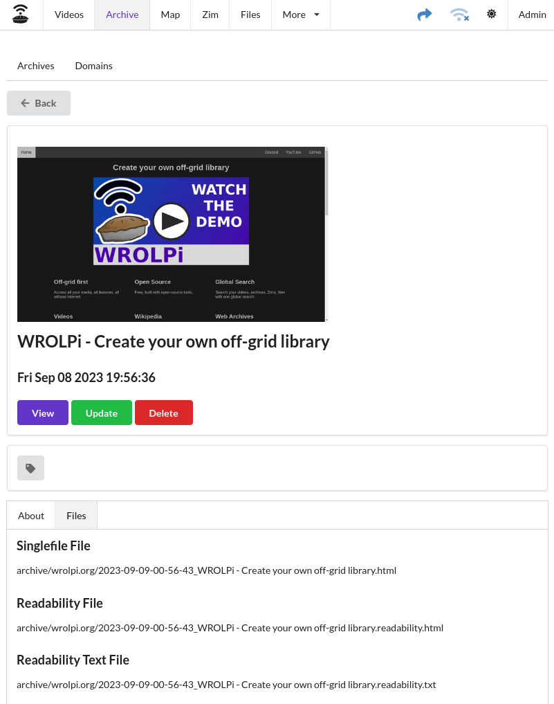
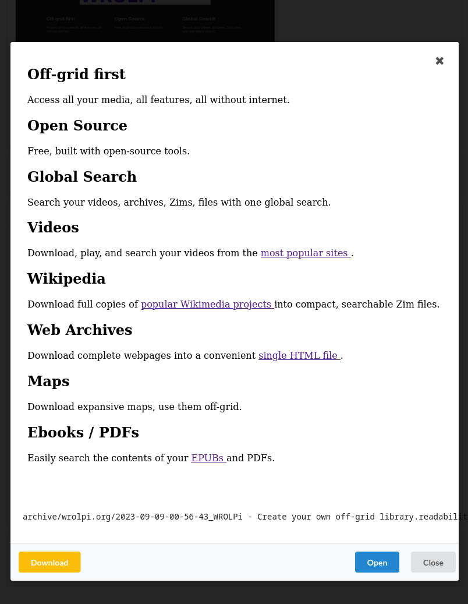

# Archives

The Archives module allows viewing, organizing, and downloading of webpages as SingleFile files. Each Archive's URL
is retained, they are organized by their domain in the Domains tab.

## Singlefile

A Singlefile is an HTML file which contains encoded copies of all files necessary to render a webpage. Normally a
webpage will link to many resources outside the page you are viewing, this causes problems when you attempt to save the
webpage because you will need to download and organize all of these files. Singlefile solves this problem by encoding
and embedding all the related files within a single HTML file.

The Singlefile project has many advantages.

* A single HTML file that can be easily shared with others.
* All that is necessary to view the archive is a compatible browser. No external files or services.
* An exact copy that handles rendering of Javascript that the page will contain.
* Images and style is preserved.

## Readability

[Readability](https://github.com/mozilla/readability) is a Mozilla project which extracts the article from a web page.
Because a web page is made up of many HTML, CSS, Javascript words that we do not want to search, WROLPi uses Readability
to extract the words that will be indexed.

## Domain

A domain is the host of the archived URL. For example, the host of https://wrolpi.org/getting-started is wrolpi.org.