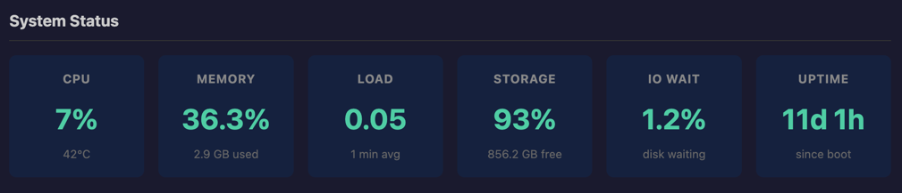
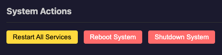
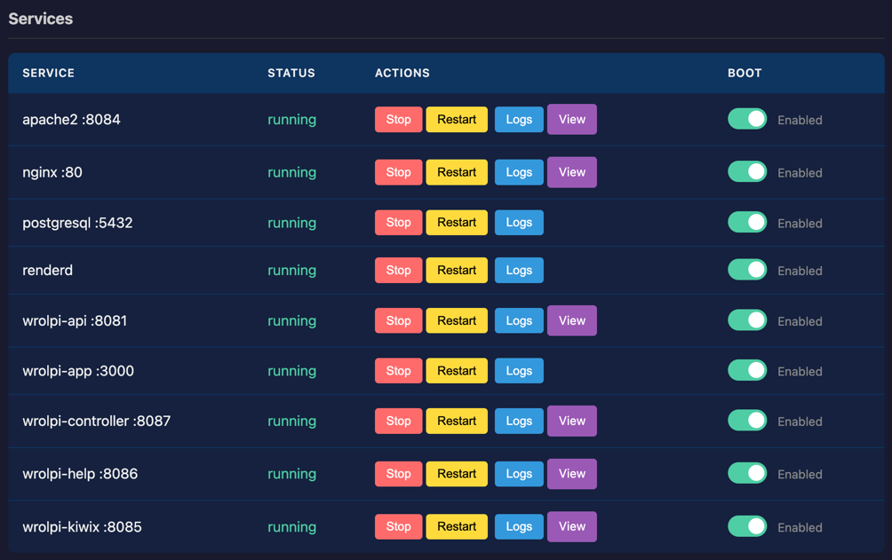
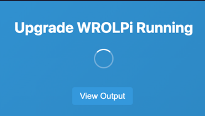

# Controller Dashboard

The Controller provides a standalone web dashboard that works independently from the main WROLPi
application. This ensures you always have access to critical system information and controls.

## Accessing the Dashboard

The dashboard is available at:

```
http://<your-wrolpi-ip>:8087
```

## When to Use the Dashboard

The standalone dashboard is useful when:

- The main WROLPi app is down or unresponsive
- WROLPi is upgrading
- You need quick access to system status
- You're troubleshooting service issues

## Dashboard Sections

### System Status Cards

The top of the dashboard displays real-time system metrics:

| Metric      | Description                                  |
|-------------|----------------------------------------------|
| **CPU**     | Current CPU usage percentage and temperature |
| **Memory**  | RAM usage (used/total) and percentage        |
| **Load**    | 1-minute system load average                 |
| **Storage** | Primary drive usage and free space           |
| **IO Wait** | Percentage of time CPU waits for disk I/O    |
| **Uptime**  | Time since last boot                         |



### System Actions

Quick action buttons for system-wide operations:

- **Restart All Services** - Restarts all WROLPi services (Controller restarts last)
- **Reboot** - Reboots the entire system
- **Shutdown** - Shuts down the system (native mode only)



### Services Table

Lists all WROLPi services with their current status:

- Service name and port number
- Status indicator (running/stopped/failed)
- Control buttons (Start/Stop/Restart)
- Log viewer button
- Link to service UI (if applicable)
- Boot toggle (enable/disable at startup)

_The following screenshot is from a healthy WROLPi._



### Disk Management

Shows detected drives and partitions:

- Device name and size
- Filesystem type and label
- Mount/unmount controls
- Persistent mount toggle

### Drive Health (SMART)

Displays health information for connected drives:

- Overall assessment (PASS/FAIL/WARN)
- Temperature
- Power-on hours
- Sector health

## Fallback Mode

When the main WROLPi API is unavailable, the dashboard enters "fallback mode":

- A notice appears indicating the main app is down
- The dashboard continues to function normally
- Once the main app recovers, you're automatically redirected

## Upgrade Mode

During system upgrades:

- The dashboard shows upgrade status
- An elapsed time counter tracks upgrade duration
- Service logs are available for monitoring progress
- The system automatically returns to normal once the upgrade completes



## Auto-Refresh

The dashboard automatically refreshes system metrics every few seconds. The refresh interval adapts
based on system load to minimize overhead.
