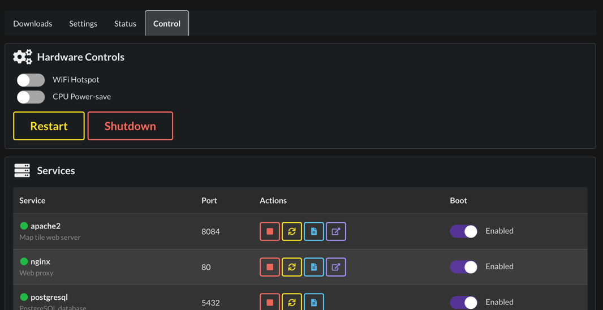

# Controller

The WROLPi Controller is a system management service that provides monitoring, service control, disk
management, and administrative functions for your WROLPi instance.

## Why the Controller?

The Controller runs independently from the main WROLPi application. This means:

- **System management is always available** - Even if the main app crashes or is upgrading, you can still
  manage services, mount disks, and monitor system health.
- **Fallback UI** - When the main React app is unavailable, the Controller provides a standalone dashboard.
- **Critical operations** - Shutdown, reboot, and service restart are handled by a dedicated service.

## Accessing the Controller

### From the Main App

Navigate to **Admin > Control** in the main WROLPi interface to access Controller features integrated into
the React UI.



### Standalone Dashboard

The Controller has its own standalone web interface available at:

```
http://<your-wrolpi-ip>:8087
```

This dashboard works even when the main WROLPi app is down.

### During Upgrades

When WROLPi is upgrading, nginx automatically redirects to the Controller dashboard so you can monitor the
upgrade progress and system status.

## Features

### [Dashboard](dashboard.md)

The standalone HTML dashboard provides real-time system monitoring:

- CPU usage and temperature
- Memory utilization
- Storage space
- System load and IO wait
- Uptime

### [Service Management](services.md)

Control all WROLPi services:

- Start, stop, and restart services
- View service logs
- Enable or disable services at boot

### [Disk Management](disks.md)

Manage external drives and storage:

- Mount and unmount drives
- Configure persistent mounts (survive reboots)
- View disk information (size, filesystem, label)

### [SMART Monitoring](smart.md)

Monitor drive health:

- Drive health assessment (PASS/FAIL/WARN)
- Temperature monitoring
- Power-on hours
- Sector health (reallocated, pending)

### [System Actions](system.md)

Administrative controls:

- Restart all WROLPi services
- Reboot the system
- Shutdown the system
- WiFi hotspot control (Raspberry Pi)
- CPU throttling/governor control

## Docker vs Native Mode

The Controller operates differently depending on how WROLPi is deployed:

| Feature            | Native (Raspberry Pi) | Docker                 |
|--------------------|-----------------------|------------------------|
| Service management | Full (systemd)        | Container control      |
| Disk mounting      | Full                  | Limited (host-managed) |
| SMART monitoring   | Full                  | Not available          |
| Hotspot control    | Full                  | Not available          |
| CPU throttle       | Full                  | Not available          |
| Shutdown/Reboot    | Full                  | Not available          |

In Docker mode, disk mounting and hardware-specific features must be managed on the host system.
