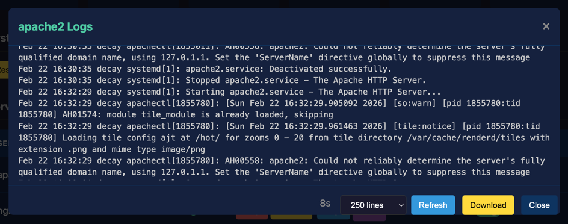
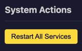
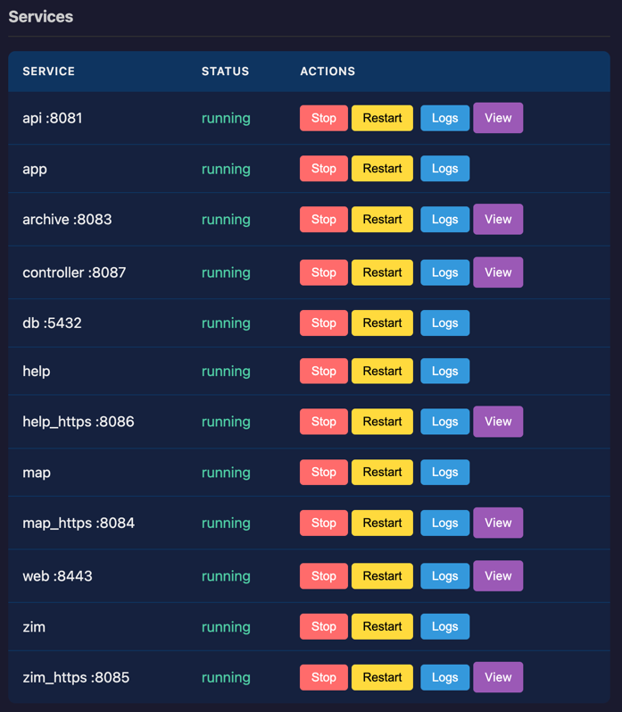

# Service Management

The Controller allows you to manage all WROLPi services from a single interface.

## Managed Services

The following services are managed by the Controller:

| Service           | Port   | Description                      |
|-------------------|--------|----------------------------------|
| wrolpi-controller | 8087   | System management (this service) |
| wrolpi-api        | 8081   | Backend API server               |
| wrolpi-app        | 5000   | React frontend application       |
| wrolpi-help       | 8084   | Documentation server             |
| wrolpi-kiwix      | 8085   | Offline wiki server (Kiwix)      |
| renderd           | -      | Map tile rendering               |
| apache2           | -      | Map tile server                  |
| postgresql        | -      | Database server                  |
| nginx             | 80/443 | Web server and reverse proxy     |

Development services (shown only when running):

- wrolpi-api-dev - API in debug mode
- wrolpi-app-dev - Frontend in development mode
- wrolpi-upgrade - System upgrade process

## Service Controls

### Starting a Service

Click the **Start** button next to a stopped service to start it. The status will update once the
service is running.

### Stopping a Service

Click the **Stop** button to stop a running service. Use caution when stopping critical services
like nginx or postgresql.

### Restarting a Service

Click the **Restart** button to stop and start a service. This is useful when a service is
misbehaving or after configuration changes.

### Enabling/Disabling at Boot

Toggle the boot switch to control whether a service starts automatically when the system boots.
This is only available in native mode (systemd).

## Viewing Service Logs

Click the **Logs** button to view recent log output for a service.

### Log Options

- **Lines** - Number of log lines to retrieve (100-5000)
- **Download** - Save logs as a text file for offline analysis

### Auto-Scroll

When viewing logs, scroll to the bottom to enable auto-refresh. New log entries will appear
automatically. Scroll up to pause auto-refresh.

## Restart All Services

The "Restart All Services" button restarts all WROLPi services in sequence. The Controller
restarts itself last to ensure the operation completes.

This is useful after:

- System configuration changes
- Recovering from errors
- Applying updates

## Docker Mode

In Docker deployments, the Controller manages Docker containers instead of systemd services:

- Container start/stop/restart is available
- Boot toggle is not available (managed by Docker Compose)
- Container names differ from native systemd service names

### Docker Container Architecture

Docker mode uses HTTPS proxy containers to expose services securely:

| Service | Internal Container | HTTPS Proxy  | Port |
|---------|--------------------|--------------|------|
| Help    | `help`             | `help_https` | 8086 |
| Map     | `map`              | `map_https`  | 8084 |
| Kiwix   | `zim`              | `zim_https`  | 8085 |
| Archive | -                  | `archive`    | 8083 |

Other containers:

- `api` - Backend API (port 8081)
- `app` - React frontend
- `controller` - Controller service (port 8087)
- `db` - PostgreSQL database (port 5432)
- `web` - Nginx reverse proxy (port 8443)

*The following screenshot is from a healthy WROLPi running in Docker containers*

