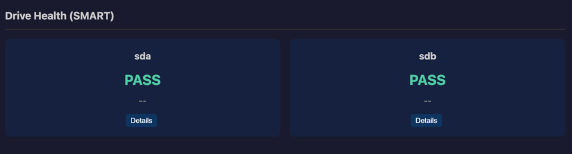
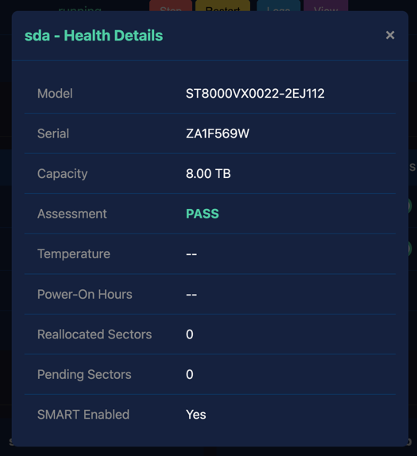
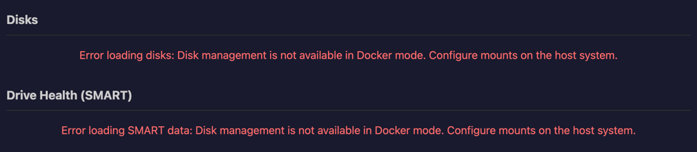

# SMART Drive Monitoring

SMART (Self-Monitoring, Analysis and Reporting Technology) provides early warning of drive
failures. The Controller monitors SMART data for all connected drives.

## Drive Health Assessment

Each drive displays an overall health assessment:

| Status   | Meaning                                      |
|----------|----------------------------------------------|
| **PASS** | Drive is healthy, no issues detected         |
| **WARN** | Potential issues detected, monitor closely   |
| **FAIL** | Drive is failing or has failed, replace soon |

_Image taken from a WROLPi with two external USB disks_

## Monitored Attributes

### Temperature

Current drive temperature in Celsius. High temperatures can indicate:

- Poor ventilation
- Heavy workload
- Impending failure

Most drives operate safely below 50°C. Temperatures above 60°C may reduce drive lifespan.

### Power-On Hours

Total hours the drive has been powered on. This helps estimate drive age and remaining lifespan.
Most drives are rated for 3-5 years of continuous operation (26,000-44,000 hours).

### Reallocated Sector Count

Number of bad sectors that have been remapped to spare sectors. A small number is normal over
time, but rapid increases indicate drive degradation.

### Pending Sector Count

Sectors waiting to be remapped. These are sectors that had read errors but haven't been
reallocated yet. Non-zero values warrant monitoring.

## Viewing Detailed SMART Data

Click on a drive's SMART status to view the full SMART attributes table. This includes:

- All SMART attribute values
- Threshold values
- Raw values
- Worst recorded values

## Drives Without SMART

Some drives don't support SMART monitoring:

- USB flash drives
- SD cards
- Some external enclosures that don't pass SMART data
- Virtual disks

These drives will show "SMART not available" in the status.

## Recommendations

- **Check SMART status regularly** - Weekly checks can catch problems early
- **Replace WARN drives soon** - Don't wait for failure
- **Backup immediately on FAIL** - Data loss may be imminent
- **Monitor temperature** - Ensure adequate cooling

## Docker Mode

SMART monitoring requires direct hardware access and is not available in Docker deployments.
Monitor drive health from the host system instead.

