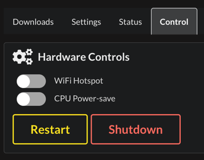

# System Actions

The Controller provides administrative controls for system-wide operations.

## Restart All Services

Restarts all WROLPi services in sequence:

1. wrolpi-api
2. wrolpi-app
3. wrolpi-help
4. wrolpi-kiwix
5. Other services as needed
6. wrolpi-controller (restarts last)

The Controller restarts itself last to ensure all other services are restarted first.

**Use when:**

- Services are unresponsive
- After configuration changes
- To clear stale state

## Reboot System

Reboots the entire WROLPi system. The system will:

1. Stop all services gracefully
2. Unmount filesystems
3. Restart the operating system
4. Boot and start all services

The reboot process takes 1-3 minutes depending on hardware. After reboot, the system will
be accessible at the same IP address (unless DHCP assigns a new one).

**Use when:**

- System is unstable
- After system updates
- Hardware changes require a fresh boot

## Shutdown System

Shuts down the WROLPi system completely. The system will:

1. Stop all services gracefully
2. Unmount filesystems
3. Power off

**Note:** Physical access is required to power the system back on.

This feature is only available in native mode, not Docker.

## WiFi Hotspot (Raspberry Pi)

On Raspberry Pi, the Controller can manage a WiFi hotspot for direct device connections.

### Hotspot Status

- **Disconnected** - Hotspot is off
- **Connected** - Hotspot is active, devices can connect
- **In Use** - Devices are currently connected
- **Unavailable** - WiFi hardware not available

### Enabling the Hotspot

1. Click **Enable Hotspot**
2. The Pi will create a WiFi network

Default hotspot settings:

- **SSID:** WROLPi
- **Password:** wrolpi hotspot
- **Device:** wlan0

### Disabling the Hotspot

Click **Disable Hotspot** to turn off the WiFi access point. Connected devices will be
disconnected.

### When to Use Hotspot

The hotspot is useful for:

- Direct connection when no WiFi network is available
- Field use without infrastructure
- Initial setup before configuring WiFi

## CPU Throttling (Raspberry Pi)

Control CPU performance and power consumption on Raspberry Pi.

### Throttle Status

Shows the current CPU governor:

- **ondemand** - Normal operation, scales with demand
- **powersave** - Reduced speed, lower power consumption
- **performance** - Maximum speed (not recommended for sustained use)

### Enable Throttle (Powersave)

Switches to powersave mode:

- Reduces CPU frequency
- Lowers power consumption
- Reduces heat generation
- May slow down intensive operations

**Use when:**

- Running on battery power
- Reducing heat in enclosed spaces
- Minimizing power draw

### Disable Throttle

Returns to normal operation (ondemand governor):

- CPU scales with workload
- Full performance available when needed
- Normal power consumption

## Docker Mode Limitations

The following system actions are not available in Docker deployments:

- Shutdown
- Reboot
- WiFi hotspot control
- CPU throttling

These operations must be performed on the host system.
