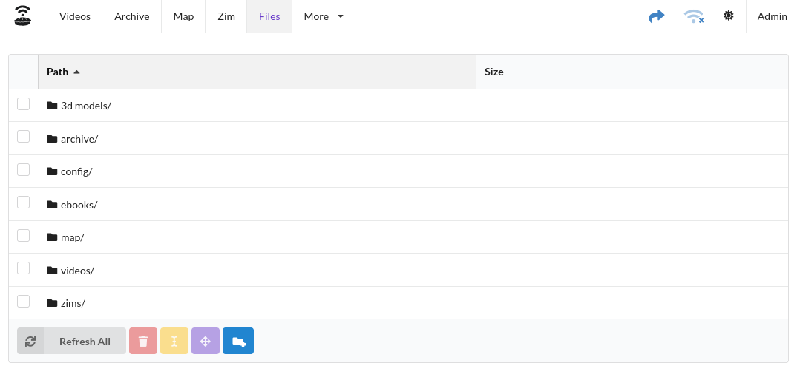
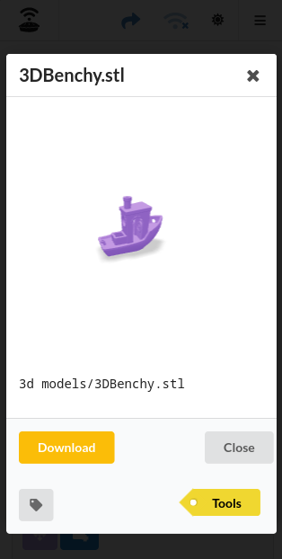
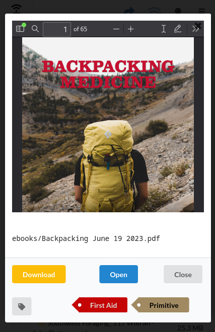

# Files

The Files module allows you to view the files found in your media directory. No files outside the media directory
can be viewed.

The Files module is different from other modules in WROLPi (Videos/Archives/etc.) because the files displayed are not
fetched from the database, they are read from the media directory live. This is necessary to allow refreshing of files
that have recently been created, and are not yet in the database.

## Refreshing

WROLPi can search any file in your media directory, this can only be accomplished after a full files refresh has been
completed.

> To refresh all your files, click the **Files** link in the top navigation bar, then click **Refresh All** found at the
> bottom of the files table.

## Files Tools

The contents of the media directory can be manipulated in the Files module using the buttons on the bottom of the files
table.

**It is recommended to manipulate files using the provided tools. WROLPi can lose track of your files if you manipulate
them outside of these tools.**

The tool buttons are as displayed:

1. **Refresh All** or **Refresh** button
    * This button will refresh all files in your media directory, or any files/directories you have selected.
2. **Delete** button
    * This button will delete any files or directories selected.
3. **Rename** button
    * Allows you to rename a single file or directory.
4. **Move** button
    * Allows you to move files/directories into another directory.
5. **New Directory** button
    * Allows you to create a new directory in the directory selected (or, the top directory if no directory is
      selected.)

## File Preview

When clicking on any file, WROLPi will attempt to provide you with a preview of the file. If no previewer has been
created for the particular file type has been created, then the generic file preview will be used.

A preview of a 3D STL model file (which as been tagged with Tools):

A preview of a PDF file (which has been tagged with First Aid and Primitive):

