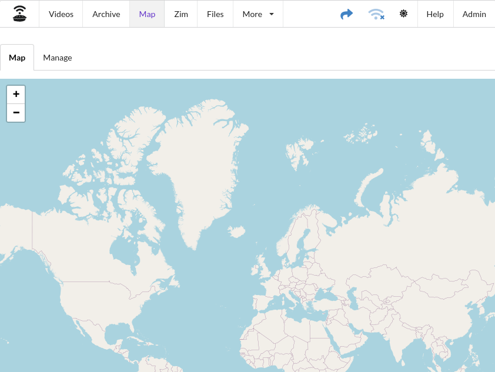
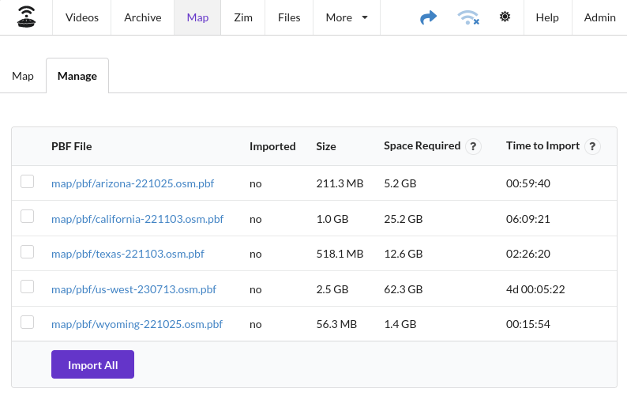
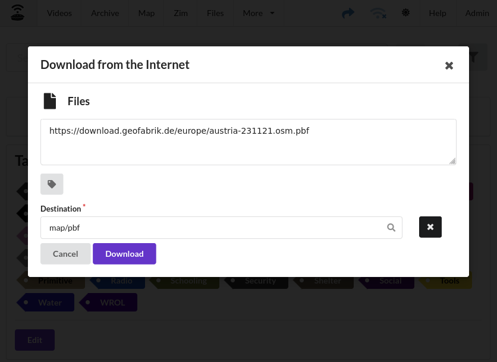

# Map

The Map module allows viewing, and importing of OpenStreetMap PBF files. The map is rendered live as you are using it.
Previously renderd tiles (images) are stored on root disk of the system which prevents re-rendering of tiles that have
been viewed previously.

## Map

The Map tab is a simple iframe around the Apache2 service on port `:8084`

## Manage

The files displayed in the Manage tab are those found in your media directory under `/map`.  **Time To Import** is
estimated by running many tests importing PBF files on a Raspberry Pi 4. The larger the file, the more inaccurate the
time will be.

> Select all map files you want to import, importing will erase any maps previously imported!

### Downloading Map Files

Map files are available for download from the Geofabrick company. You can download them using the **Files Downloader**,
save them to the `map` directory.  After they have been downloaded, you will need to import them.

