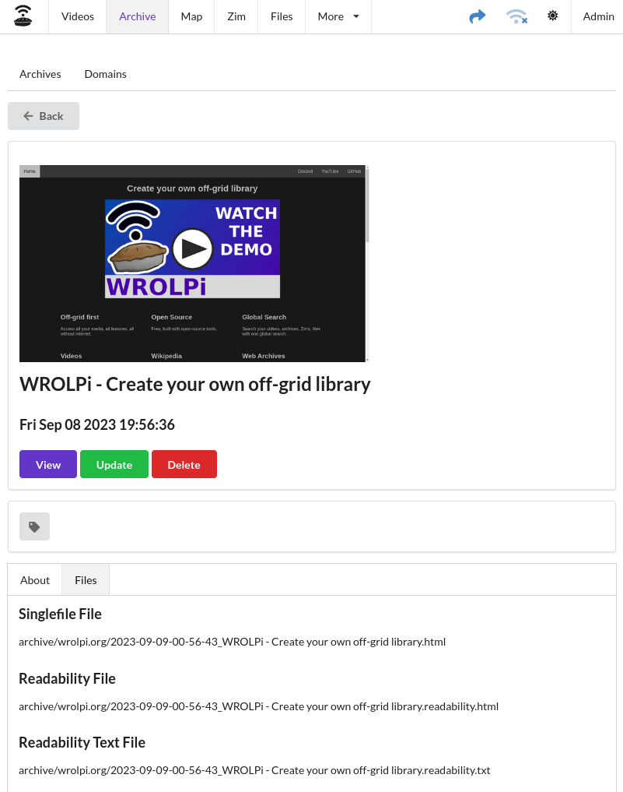
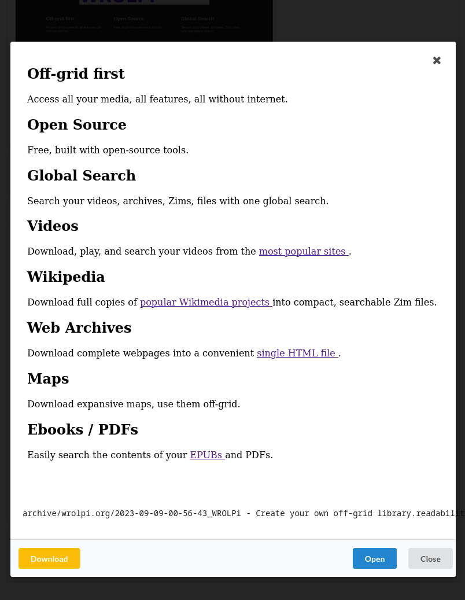

# Archives

The Archives module allows for viewing, organizing, and downloading webpages as SingleFile files. Each Archive's URL is
retained and organized by domain in the Domains tab. The Archives page (`/archive`) sorts entries by the most recently
published articles.

In the context of WROLPi, an Archive refers to a set of [similarly named files](files.md) created while archiving.
A single SingleFile file is also supported.

## Singlefile

A [Singlefile](https://github.com/gildas-lormeau/SingleFile) is an HTML file which contains encoded copies of all files
necessary to render a webpage. Normally, a webpage will link to many resources outside the page you are viewing, which
causes problems when you attempt to save the webpage because you will need to download and organize all these files.
Singlefile solves this problem by encoding and embedding all the related files within a single HTML file.

The Singlefile project has many advantages:

* It creates a single HTML file that can be easily shared with others.
* All that is necessary to view the archive is a compatible browser; no external files or services are needed.
* It provides an exact copy that handles the rendering of Javascript the page contains.
* Images and style are preserved.

## Readability

[Readability](https://github.com/mozilla/readability) is a Mozilla project which extracts the article from a web page.
Because a web page comprises many HTML, CSS, and Javascript elements that we do not want to search, WROLPi uses
Readability to extract the words that will be indexed.

## Domain

A domain is the host of the archived URL. For example, the host of `https://wrolpi.org/getting-started` is `wrolpi.org`.

## Searching

When the indexes for an Archive are generated for searching, they are searched in the following order of precedence:

1. Title
2. HTML Metadata Description
3. Readability Text
