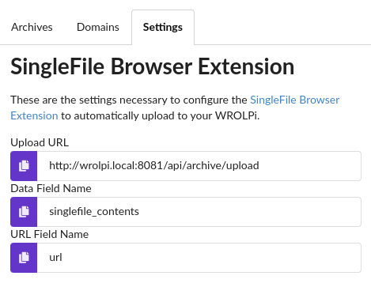
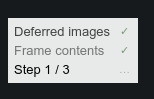
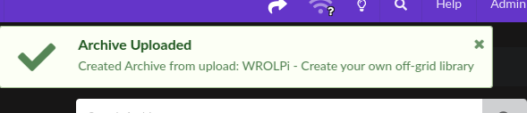

# SingleFile Browser Extension

Archives in WROLPi are made from a [SingleFile](https://github.com/gildas-lormeau/SingleFile). The project offers
browser extensions which can be used to manually archive a webpage.

The extension can be configured to upload any page you archive to your WROLPi. WROLPi will convert the singlefile to an
Archive by extracting the readability, screenshot, etc.

## Browser Extensions

* [Firefox](https://addons.mozilla.org/en-US/firefox/addon/single-file/)
* [Chrome](https://chromewebstore.google.com/detail/singlefile/mpiodijhokgodhhofbcjdecpffjipkle)
* [Safari](https://apps.apple.com/us/app/singlefile-for-safari/id6444322545)
* [Edge](https://microsoftedge.microsoft.com/addons/detail/singlefile/efnbkdcfmcmnhlkaijjjmhjjgladedno)

## Configure Browser Extensions

### Firefox

1. Install the [addon](https://addons.mozilla.org/en-US/firefox/addon/single-file/)
2. Navigate to: `about:addons`, or, **Menu** > **Add-ons and Themes** > **Extensions**
3. Open the **SingleFile** extension header.
4. Open the **Preferences** Tab.
5. Open the **Destination** row.
6. Scroll to the bottom and enter the following fields:
    1. In a separate tab, open your WROLPi web interface, navigate to **Archive** > **Settings**.
        * 
    2. Copy the **Upload URL**, paste it into **upload to REST Form API** > `URL`
        * Note: Your URL will be different depending on the IP address or hostname of your WROLPi.
    3. Copy the **Data Field Name**, paste it into **upload to REST Form API** > `archive data field name`
    4. Copy the **URL Field Name**, paste it into the **upload to REST Form API** > `archive URL field name`
    5. The configured extension:
        * 

### Chrome

1. Install the [extension](https://chromewebstore.google.com/detail/singlefile/mpiodijhokgodhhofbcjdecpffjipkle)
2. Navigate to `chrome://extensions`, or, **Menu** > **Extensions** > **Manage Extensions**
3. Click the **SingleFile** extension **details** button.
4. Open the **Extension Options** popup.
5. Open the **Destination** row.
6. Scroll to the bottom and enter the following fields:
    1. In a separate tab, open your WROLPi web interface, navigate to **Archive** > **Settings**.
        * 
    2. Copy the **Upload URL**, paste it into **upload to REST Form API** > `URL`
        * Note: Your URL will be different depending on the IP address or hostname of your WROLPi.
    3. Copy the **Data Field Name**, paste it into **upload to REST Form API** > `archive data field name`
    4. Copy the **URL Field Name**, paste it into the **upload to REST Form API** > `archive URL field name`
    5. The configured extension:
        * 

## How to archive using the SingleFile extension

Using the SingleFile extension is simple, follow these steps:

1. Navigate to a webpage you want to archive.
2. Click the SingleFile extension icon, you will see a progress indicator on the bottom-left of the webpage:
    * 
3. The SingleFile extension will show an **OK** after uploading:
    * 
4. Your WROLPi will process the SingleFile, eventually a notification will be displayed in your WROLPi interface:
    * 