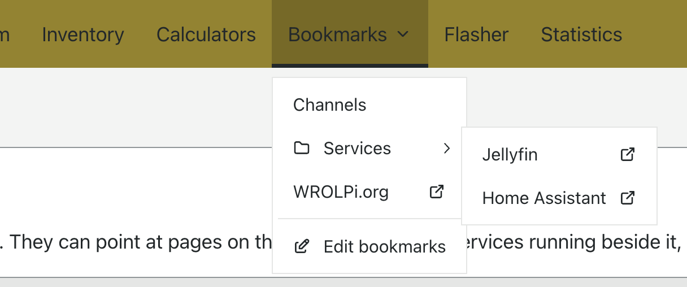
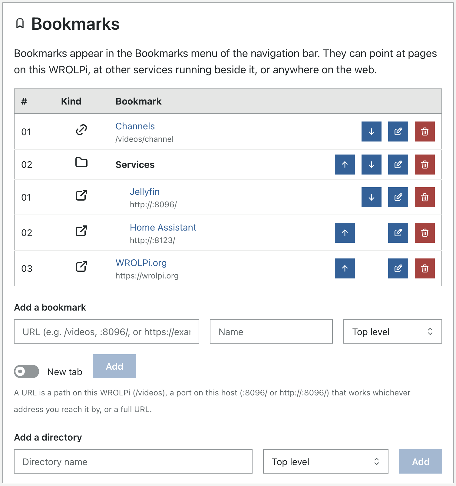

# Bookmarks

Bookmarks are your own links in the navigation bar. They can point at a page on your WROLPi, at another
service running on the same device, or at any website. Use them to reach the things you open often, or the
other services you have installed beside WROLPi, from any page.

> To see your bookmarks, hover over (or tap) **Bookmarks** in the navigation bar. On a phone, they are listed
> in the ☰ menu.



Bookmarks can be sorted into directories. A directory opens beside the menu when you hover over it; on a
phone its bookmarks are listed under its name.

## Editing bookmarks

> To add, edit, or remove bookmarks, click **Bookmarks** → **Edit bookmarks**, or go to **More** →
> **Bookmarks** when the window is too narrow to show the Bookmarks menu.



Each bookmark has a **Name**, a **URL**, a **Location** (the top level, or a directory), and a **New tab**
switch. Bookmarks appear in the menu in the order shown here; use the arrows to move a bookmark up or down
within its directory, or edit it and change its **Location** to move it somewhere else.

**Warning!** Deleting a directory deletes every bookmark inside it.

## URL forms

A WROLPi is reached by several addresses: its LAN address, its name, and its hotspot address. A bookmark that
names one of them would only work from that one. Bookmarks therefore accept three forms of URL:

| Form | Example | Opens |
|---|---|---|
| A path | `/videos/channel/3` | That page of this WROLPi, in the app. |
| A port on this device | `:8096/` or `http://:8096/web` | That port on whatever address you reached this WROLPi by. |
| A full URL | `https://wrolpi.org` | That address, as written. |

The **port** form is for the other services you run on the same device: Jellyfin, Home Assistant, a second
Kiwix, and so on. Write only the port and the path; WROLPi fills in the address the browser is already using.
Without a scheme, the bookmark uses the same scheme as the WROLPi page (`https`). Most services beside WROLPi
are plain `http`, so write `http://:8096/` for those.

Only `http` and `https` URLs are accepted. A path must be a single path on this WROLPi (`//other.host` is
not a path), and a port bookmark may not name a host.

## Where bookmarks are stored

Bookmarks live in `bookmarks.yaml` in your [config directory](../../system/configs.md). They are not in the
database, so they survive a rebuild of the database and travel with your media drive.

The file is a tree: an entry with `children` is a directory, an entry with `url` is a bookmark. Every entry
has an `id` that WROLPi uses to tell them apart; give a new entry an id that no other entry has.

```yaml
version: 3
bookmarks:
- id: 1
  name: Services
  children:
  - id: 2
    name: Jellyfin
    url: http://:8096/
    new_tab: true
- id: 3
  name: WROLPi.org
  url: https://wrolpi.org
  new_tab: true
```

You can edit the file by hand; WROLPi reads it when it starts. If the file cannot be read, or an entry has a
URL WROLPi would not accept, the menu is empty until the file is fixed and WROLPi is restarted. WROLPi never
overwrites a file it could not read.
