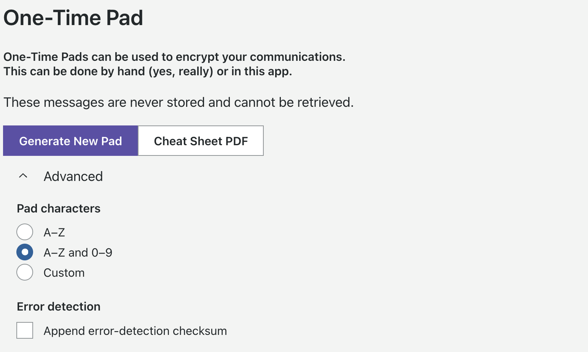
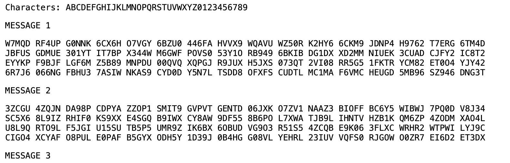
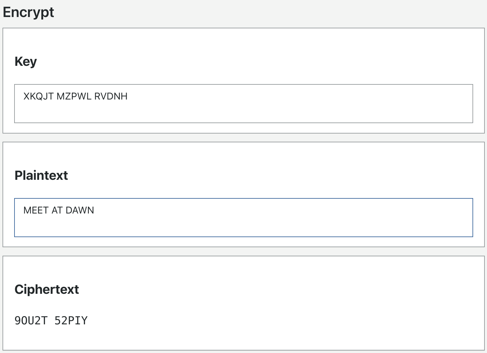
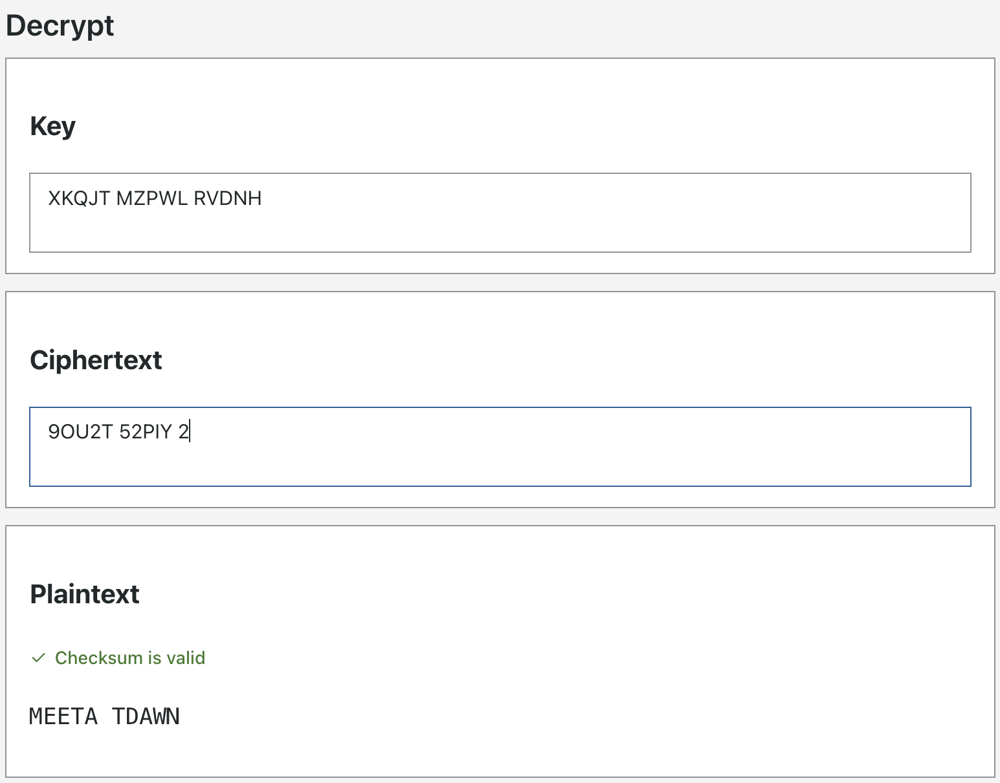

# One-Time Pad

A One-Time Pad lets you encrypt short messages so they can be passed over an insecure channel — read aloud over
radio, handed over on paper, or sent by courier. WROLPi can generate a pad for you, and can encrypt and decrypt
messages with it. You can also do the same work with nothing but the printed pad and a pencil.

> To open it, click **More** → **Calculators** → **One Time Pad**.

Everything on this page happens **inside your browser**. Your pad, your message, and the encrypted result are
never sent to the WROLPi server, and they are never stored. Reload the page and they are gone.

## Generate a Pad

> Click **Generate New Pad**.

A new page opens containing 8 numbered messages. Each message is 320 random characters, printed as groups of five
characters, 16 groups per line.

The characters are chosen with your browser's cryptographically secure random number generator, so the pad is
unpredictable. Every pad is unique — the page is generated fresh each time you click the button, and WROLPi keeps
no copy of it.

Print the page and give a copy to everyone you trust to exchange messages with. Everyone in the group must hold
the **same** pad, because the sender and receiver both use the same characters.

**Warning!** Use each message **only once**. A pad character that is reused can be broken. Cut off and burn each
message as it is used.

## Encrypt

Both the sender and the receiver need the same two things: the **key** (an unused message from the pad) and the
character set the pad was built from.

* **Key** — type or paste the random characters from your One-Time Pad.
* **Plaintext** — the message you want to send.
* **Ciphertext** — the encrypted result, updated as you type.

Spaces and line breaks are ignored in both boxes, so you can paste the pad exactly as it is printed. When the
character set contains only uppercase characters (as both built-in sets do) your typing is uppercased for you.
The ciphertext is printed in groups of five characters, which is the traditional format for reading a message
aloud.

The key must be at least as long as the plaintext. If it is shorter you will see *Plaintext is longer than OTP*.
If either box contains a character that is not in the pad's character set, you will see an *invalid characters*
error — punctuation is not encryptable, so spell it out (for example `STOP` instead of `.`).

## Decrypt

* **Key** — the same pad message the sender used.
* **Ciphertext** — the message you received.
* **Plaintext** — the decrypted message.

The plaintext is also shown in groups of five, so word breaks are not preserved: `MEET AT DAWN` comes back as
`MEETA TDAWN`.

## Advanced

### Pad Characters

The character set is a property of the pad — generating, encrypting, and decrypting all use whichever set is
selected here, so the whole group must agree on it before any pads are printed.

| Setting | Characters |
| --- | --- |
| **A–Z** | The 26 uppercase letters. The easiest set to work by hand. |
| **A–Z and 0–9** | The 26 letters plus the 10 digits (the default). Lets you send numbers without spelling them out. |
| **Custom** | Any set you define. |

A custom set must have between 2 and 256 characters, they must all be unique, and it cannot contain spaces. A
custom set that includes lowercase characters is treated as case-sensitive — nothing is uppercased for you, so
`a` and `A` are two different characters (and both must appear in the set).

**Warning!** The [cheat sheet](#by-hand) table is built for the **A–Z and 0–9** set only. If you change the
character set, the printed table no longer applies and the pad can only be used by hand with a table you make
yourself.

### Error Detection

> Tick **Append error-detection checksum**.

With this enabled, encryption adds one extra character to the end of the ciphertext. That character is calculated
from the **ciphertext**, not from your plaintext, so it gives away nothing about your message — it is worked out
from the encrypted characters that get sent anyway. If a character is misheard, mistyped, or two characters are
swapped in transit, the receiver is told about it.

When decrypting with the checkbox ticked, WROLPi shows **Checksum is valid** or **Checksum is invalid** above the
plaintext. An invalid checksum means the message arrived corrupted — ask the sender to repeat it rather than
trusting what you decrypted.

Both the sender and receiver must have the setting turned on. If the receiver has it on and the message does not
actually carry a checksum, WROLPi says the checksum is invalid and decrypts the whole message anyway, so no
character is silently dropped.

## By Hand

A One-Time Pad needs no computer. WROLPi ships a printable reference table so you can encrypt and decrypt with a
pencil.

> Click **Cheat Sheet PDF** to open it, then print it along with your pads.

The sheet is a grid of the **A–Z and 0–9** characters:

* **Sending / encrypting** — find the intersection of the row for your pad character and the column for the
  character you want to send. The character in that cell is what you send.
* **Receiving / decrypting** — follow the row of your pad character until you find the character you received;
  the column header is the decrypted character.

Work one character at a time, striking through each pad character as you use it.

## Rules to Follow

1. Every member of the group has their own copy of the same pad.
2. Each pad message is used once, then destroyed.
3. The pad is only as secret as its worst copy — a pad that has been photographed, emailed, or left lying around
   is no longer a secret.
4. Only the characters in the pad's character set can be sent. Spell out punctuation and word breaks.
5. A pad message limits how long your message can be. Keep messages short.
