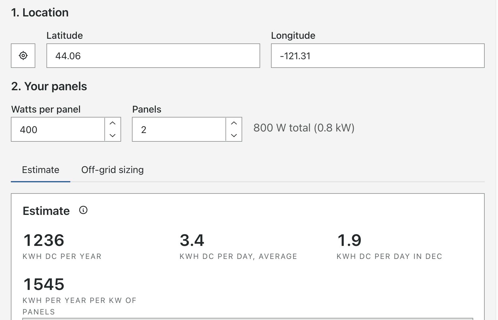
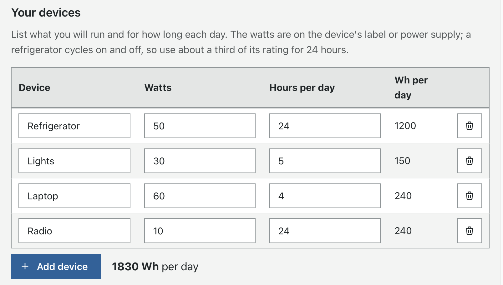
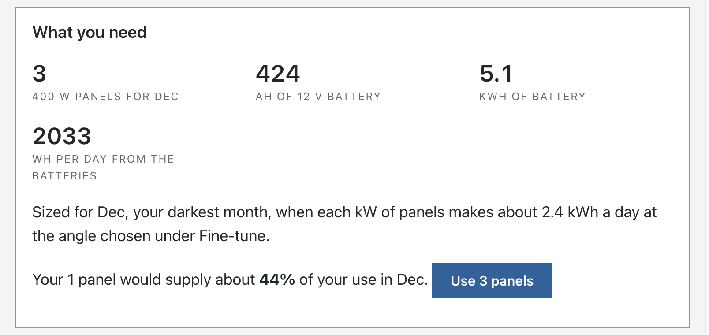

# Solar

The Solar calculator estimates what solar panels will produce over a typical year at any place on Earth, and
sizes a battery system to run your devices through the darkest month. It works completely offline: the sunlight
and temperature data for the whole world ship with WROLPi.

> To open it, click **Calculators** (under **More** on smaller screens), then **Solar**. Enter a location and
> your panels; everything else has sensible defaults.

Every setting is saved in the page address, so you can bookmark a design, or share it with the Share button
(the QR code carries the whole configuration).

## Example: powering an off-grid cabin

You are planning a small cabin with a refrigerator, lights, a laptop and a radio, and want to know how many
panels and how much battery to buy.

1. **Location.** Type the cabin's latitude and longitude, or click the location button to the left of Latitude
   to use your device's current location. You can also right-click (or long-press) the spot on the
   [Map](../map/index.md) and choose **Calculate Solar Performance**, or use the sun button beside a saved pin.
2. **Your panels.** Enter the watts printed on the panel you plan to buy (for example 400 W) and leave
   **Panels** at 1 for now.
3. Click the **Off-grid sizing** tab.
4. **Your devices.** Add each device with its watts and hours of use per day. The watts are on the device's
   label or power supply. A refrigerator turns on and off, so use about a third of its rating for 24 hours.

    

5. **Batteries.** Choose the battery type, the system voltage, and how many **days without sun** the batteries
   must cover (two or three is typical). Turn on **Batteries are outdoors or unheated** if they will sit in a
   cold shed.
6. Read **What you need**: the number of panels, the battery size in amp-hours and kWh, and how much of your use
   your current panels would cover in the darkest month. Click **Use N panels** to apply the suggested count.

    

7. **Charge controller and wiring.** Copy the four numbers from the label on the back of your panel, choose your
   controller, and set how many panels are wired in series. Fix anything shown in red or orange (see
   [Warnings](#warnings)).

Back on the **Estimate** tab you can see the month-by-month production of the system you just sized.

## Other things it can answer

### How much do my existing panels make, and how far could I expand?

Enter your existing panels, their tilt and direction (under **Fine-tune** → **Panel angle**), and compare the
monthly table with your charge controller's or inverter's own history. Then raise **Panels** to see what an
expansion would add. If your system makes much less than the estimate, see
[Why is my system making less?](#why-is-my-system-making-less)

### Emergency and portable power

A folding panel and a portable power station can keep a radio, phones, a CPAP machine or a freezer running
through an outage. Enter the panel's watts and your few essential devices on the **Off-grid sizing** tab; the
battery size tells you what capacity of power station to look for.

### Where and how should I mount the panels?

Under **Fine-tune** → **Panel angle**, try different tilts and directions and watch the yearly total. **Best for
the year** and **Best for winter** find the best tilt for you. Under **Panel details**, compare **Tracking**
options to see whether a tracker is worth its cost. To compare two sites, such as your home and a cabin, open
each from the map.

### Will this kit work?

Kits often pair panels with a battery and controller that do not suit each other. Enter the kit on the
**Off-grid sizing** tab: a PWM controller with a high-voltage panel, a battery too small for your devices, or
too many panels in series for the controller will all show up.

### RVs, vans and boats

Panels on a vehicle roof lie flat. Set the tilt to 0 under **Fine-tune** → **Panel angle**; the direction then
makes no difference. Enter where you will spend the darkest month.

### Panels facing more than one direction

The calculator models one group of panels at a time. If you have panels on an east roof and a west roof, size
each group separately and add the results.

### Covering a utility bill

Find your yearly use in kWh on your bills, then divide it by the **kWh per year per kW of panels** on the
**Estimate** tab. The result is the kW of panels you need; divide by your panel's watts (in kW) for the number of
panels.

### Why is my system making less?

If your real output is well below the estimate in sunny months, check for:

* **Shade** from trees, buildings or chimneys, even on part of one panel. Raise **Shading** under **System
  losses** to match.
* **Dirt, dust, pollen or snow** on the panels. Raise **Soiling** or **Snow**.
* **A different angle** than you entered.
* **A PWM controller** with panels rated well above the battery's voltage (see [Warnings](#warnings)).
* **A failing panel, connection or controller.**

## Reading the estimate

| Figure | Meaning |
|---|---|
| kWh per year | Expected yearly production. DC unless the inverter is turned on. |
| kWh per day, average | The yearly total divided by 365. |
| kWh per day in the worst month | What the darkest month makes each day; size off-grid systems for this. |
| kWh per year per kW of panels | Production per kilowatt of panels, for comparing sites and designs. |
| Sun hours on panel | Sunlight reaching the tilted panel, in kWh/m² per day: the honest "peak sun hours". |

## Fine-tune settings

The defaults suit a typical ground-mounted array of ordinary panels facing the equator.

| Setting | Default | Notes |
|---|---|---|
| Tilt | Your latitude | Degrees from flat. **Best for the year** and **Best for winter** set it for you. |
| Facing | Toward the equator | Compass degrees: 180 is south, 0 is north. |
| Panel type | Standard | Sets the temperature coefficient; copy yours from the datasheet for accuracy. |
| Mounting | Open rack | Panels flush against a roof run hotter and make a little less. |
| Tracking | Fixed | Single-axis turns east to west through the day; dual-axis follows the sun fully. |
| Ground reflectance | From the data | Snow reflects extra light onto tilted panels; the data includes seasonal snow. |
| System losses | 14.08% | The PVWatts defaults: soiling, shading, wiring, mismatch and more. |
| Inverter | Off | Turn on for AC output from a grid-tie or hybrid inverter. Off-grid sizing ignores it. |

## Off-grid sizing settings

| Setting | Default | Notes |
|---|---|---|
| Devices run on AC | On | Adds the inverter's loss (90% efficient by default). Turn off for 12 V devices. |
| Battery type | LiFePO4 | LiFePO4 uses 80% of its capacity; lead-acid only 50%, so it must be twice as large. |
| System voltage | 12 V | Larger systems use 24 or 48 V to keep currents and wire sizes down. |
| Days without sun | 2 | How long the batteries carry your devices through cloudy weather. |
| Panel label values | A typical 400 W panel | Voc, Vmp, Isc and the Voc temperature coefficient, from your panel's label. |
| Controller max PV voltage | 100 V | The highest panel voltage your controller accepts, from its label. |
| Coldest morning | Coldest monthly average minus 25 °C | Enter your area's record low if you know it. |

## Warnings

* **Too much voltage for the controller.** Panels make a higher voltage when cold. On a cold morning a string
  of panels in series can exceed the controller's limit and destroy it. Put fewer panels in series, or buy a
  controller rated for more voltage.
* **Too little voltage to charge.** An MPPT controller needs the panels' voltage well above the battery's. Put
  more panels in series.
* **Uneven strings.** Every string of panels in series should have the same number of panels.
* **High current.** A lot of current needs a large controller and thick wire; a higher system voltage reduces
  it.
* **PWM controllers** hold the panels at the battery's voltage, so a panel rated around 31 V delivers less than
  half its power into a 12 V battery. They suit "12 V" panels (about 18 V); use MPPT for anything larger.
* **Lithium batteries** are damaged by charging below 0 °C. Keep them indoors, or buy batteries with built-in
  heaters or low-temperature protection.
* **Lead-acid batteries** hold less when cold, so outdoor banks are sized larger, and a discharged battery can
  freeze.

## Using your own sunlight data

The built-in data averages over areas about 69 miles (111 km) across, which can blur mountains, valleys and
coastlines. If you have better local measurements, open **Fine-tune** → **Use my own sunlight data**: the table
starts from the built-in values so you only change what you know. Sunlight is global horizontal irradiance in
kWh/m² per day, the same number as "peak sun hours" on flat ground.

## How accurate is it?

The calculator estimates a **typical** year from long-term monthly averages. Expect it to be within about
10–15% over a year, and further off in any single month; real years vary with the weather.

Compared with NREL's PVWatts for a 1 kW array, the yearly totals came within 1% in Phoenix and within 9% in
Seattle and Anchorage, where it reads somewhat high. It does not model shade from your surroundings beyond the
Shading loss.

It uses established methods: monthly averages are spread over an average day (Erbs; Collares-Pereira & Rabl;
Liu & Jordan), transposed onto the tilted panel (Hay-Davies-Klucher-Reindl), then converted to power with the
models PVWatts uses for panel temperature, angle losses, system losses and inverters.

## Data source

Sunlight, temperature and ground reflectance come from [NASA POWER](https://power.larc.nasa.gov/) 2001–2020
monthly averages, on a 1° grid. The data is licensed
[CC BY 4.0](https://creativecommons.org/licenses/by/4.0/).

The data was obtained from National Aeronautics and Space Administration (NASA) Langley Research Center's
Prediction Of Worldwide Energy Resources (POWER) project funded through the NASA Earth Science Division. The data
was obtained from the POWER Project's POWER Climatology API v2.10.0 version on 2026/10/04.

WROLPi modified the data: values are rounded to fit one byte each (0.04 kWh/m² per day for irradiance, 0.004 for
albedo, 0.5 °C for temperature), temperatures are averaged from NASA's 0.5° × 0.625° grid into 1° cells, and the
calculator interpolates between cells.

> To see this attribution in the calculator, click **Data attribution** under the location.
