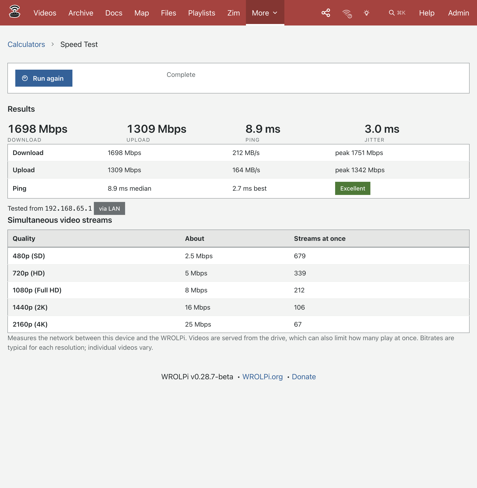

# Speed Test

The Speed Test measures the network between the device you are holding and your WROLPi. Use it to answer
questions like "is the hotspot fast enough from the back porch?" or "how many people can watch videos at
once?" without any third-party service. It works completely offline.

> To open it, click **More** → **Calculators** → **Speed Test**, then click **Start test**.

A run takes about 25 seconds:

1. **Ping** – 20 quick round trips to the WROLPi. Reported as the median and best time, plus jitter (how much
   the time varies between pings).
2. **Download** – the WROLPi streams random data to your browser for 10 seconds.
3. **Upload** – your browser sends random data to the WROLPi for 10 seconds.

Nothing is saved. Reload the page and the results are gone.

## Reading the results

* **Mbps** is megabits per second, the unit video bitrates are quoted in. **MB/s** (megabytes per second) is
  shown beside it; divide Mbps by 8 to get MB/s.
* The download and upload figures are the **steady-state average**: the first second is ignored while the
  connection ramps up. The **peak** is the fastest quarter second.
* **Ping** under 20 ms is excellent, under 60 ms is good. Over 150 ms on a local network usually means a weak
  WiFi signal.

## Simultaneous video streams

The table under the results divides your download speed by a typical bitrate for each video quality. It tells
you roughly how many people could stream that quality at the same time over this link.

| Quality | Typical bitrate |
|---|---|
| 480p (SD) | 2.5 Mbps |
| 720p (HD) | 5 Mbps |
| 1080p (Full HD) | 8 Mbps |
| 1440p (2K) | 16 Mbps |
| 2160p (4K) | 25 Mbps |

Individual videos vary a lot; a screen recording needs far less than an action movie at the same resolution.

The test measures the **network**. Videos are served from the WROLPi's drive, so a slow drive (or an SD card)
can limit playback before the network does.

## Hotspot or LAN?

Under the results the page shows the address the WROLPi saw your device at. When your WROLPi's hotspot is on
and your device has a hotspot address, it is marked **via WROLPi hotspot**. Otherwise it is marked **via LAN**.

Run the test over the hotspot from different spots to find where the signal drops off, then compare with a
wired or home-WiFi connection.

## Several people at once

There is no limit on how many devices can run the test at the same time. Have everyone press **Start test**
together to see how the link shares between them; each device's results will note how many other tests were
running during its own run.
