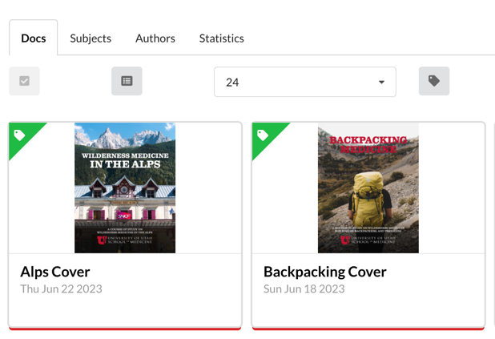
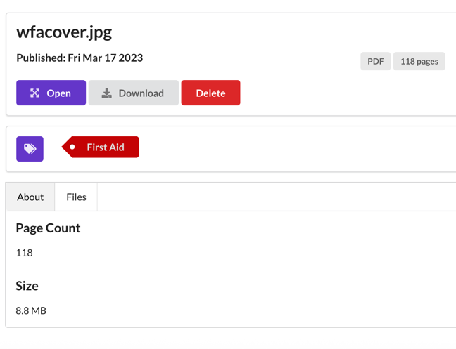

# Docs

## Overview

The Docs module provides a unified interface for viewing, organizing, and searching documents. The main page
(`/docs`) allows browsing all documents with filtering and search.

## Supported Formats

The Docs module supports the following file types:

* **eBooks** - EPUB, MOBI
* **PDFs** - PDF
* **Office Documents** - DOCX, DOC, ODT
* **Comic Books** - CBZ, CBR, CBT, CB7

## Browsing Documents

The Docs page displays all documents sorted by published date by default. You can change the sort order to:

* **Published Date** - When the document was published
* **Size** - File size
* **Title** - Alphabetical by title

When using search, results are sorted by relevance.

## Inline Viewers

Documents can be read directly in the browser without downloading:

* **EPUB** - A built-in HTML5 reader renders EPUB files.
* **PDF** - An embedded PDF viewer displays the document.
* **Comic Books** - A dedicated comic viewer displays pages with navigation controls, keyboard shortcuts
  (arrow keys), and a right-to-left mode toggle for manga.

## Authors and Subjects

The Docs module automatically creates collections for authors and subjects extracted from document metadata.

* **Authors** (`/docs/authors`) - Browse documents grouped by author.
* **Subjects** (`/docs/subjects`) - Browse documents grouped by subject.

Clicking an author or subject name filters the document list to show only matching documents.

## Searching

Documents are searchable using full-text search across their content and metadata. You can also filter by:

* Author
* Subject
* Language
* File type
* Tags

When indexes for a document are generated, they are searched in the following order of precedence:

1. Title
2. Author
3. Document contents

## Cover Images

The Docs module automatically extracts or detects cover images:

* Calibre ebook directories with a `cover.jpg`
* Cover images embedded in EPUB metadata
* First page of PDFs

## Statistics

The statistics page (`/docs/statistics`) provides an overview of your document library including total document
count, format breakdown, total size, and unique author and subject counts.
