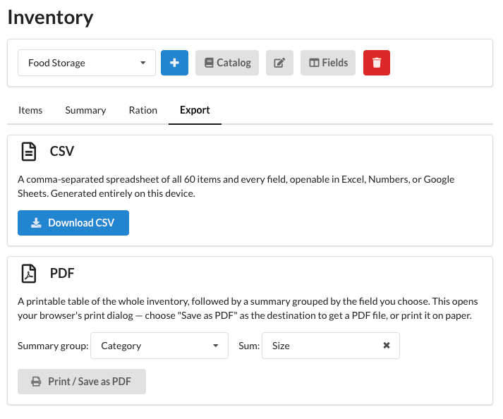

# Export

The **Export** tab produces a copy of the [inventory](index.md) you can use elsewhere.

* **CSV** — a comma-separated spreadsheet of every item and field, openable in Excel, Numbers, or Google Sheets.
  It is generated entirely on your device.
* **PDF** — a printable table of the whole inventory followed by a summary grouped by the field you choose. This
  opens your browser's print dialog; choose "Save as PDF" as the destination to get a PDF file, or print it on
  paper.
