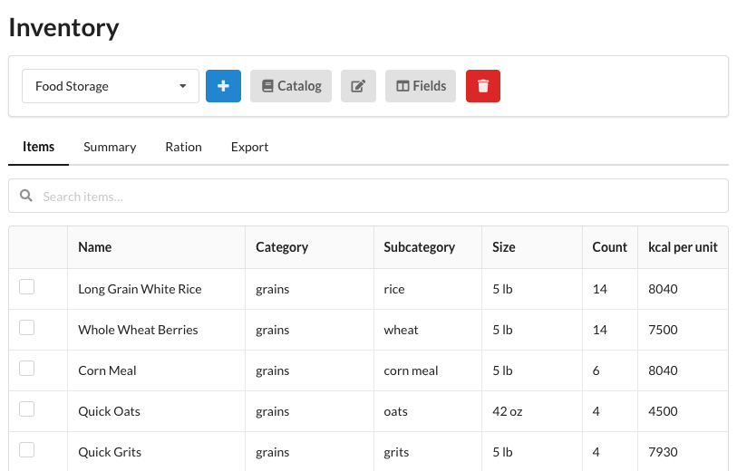
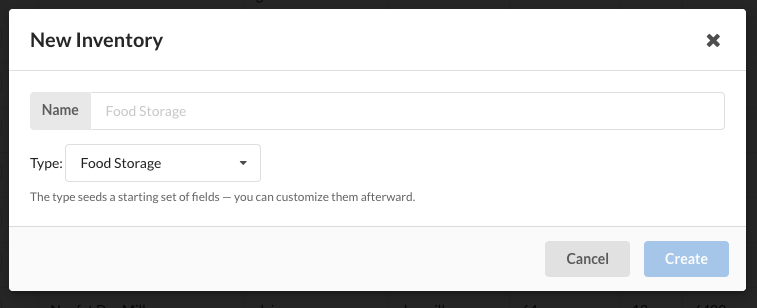
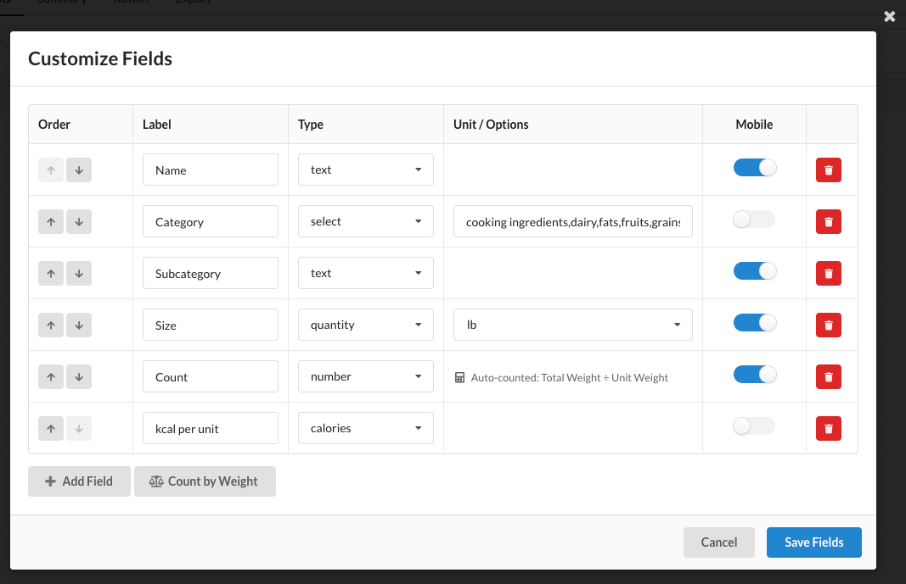
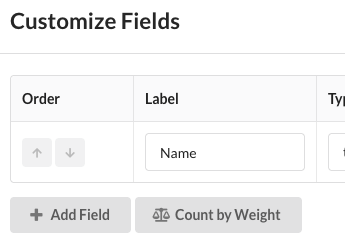
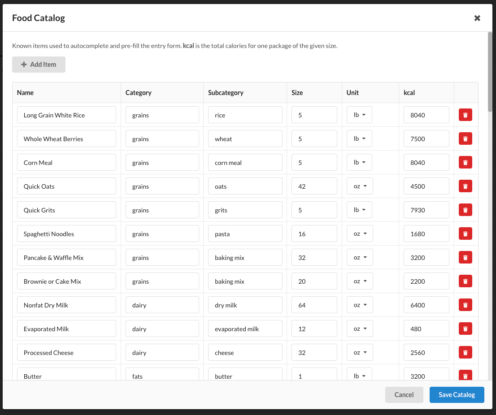
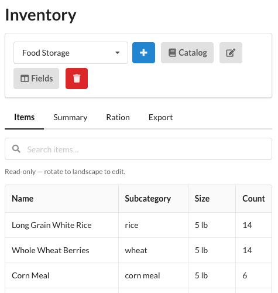

# Inventory

## Overview

The Inventory module helps you track physical supplies — food storage, fuel, tools, or anything else you want to
count and organize. The main page (`/inventory`) is a spreadsheet-style table where each row is an item and each
column is a field you control.

You can keep as many separate inventories as you like (for example, a "Food Storage" inventory and a "Fasteners"
inventory), each with its own set of fields. Inventories are stored as plain configuration files, so they survive
reboots and can be backed up, edited, or restored like any other WROLPi config (see
[Where Data Is Stored](#where-data-is-stored)).

A new WROLPi comes with a starter **Food Storage** inventory pre-filled with a recommended one-adult, one-year
supply, so you have an example to explore right away.

Each inventory has four tabs: **Items** (covered on this page), **[Summary](summary.md)**,
**[Ration](ration.md)**, and **[Export](export.md)**.

## Inventory Types

When you create an inventory you pick a **type**. The type seeds a starting set of fields — you can add, remove,
rename, reorder, or retype them afterward, so the type is only a convenient starting point.

* **Food Storage** — Brand, Name, Category, Subcategory, Size, Count, kcal per unit, and Expires.
* **Fuel** — Name, Fuel Type, Container, Size, Count, Purchased, and Location.
* **Tools** — Name, Brand, Category, Count, Condition, Location, and Notes.

To create an inventory, click the **+** button, enter a name, choose a type, and click **Create**.

Use the dropdown at the top of the page to switch between inventories. The buttons beside it let you rename the
current inventory (the pencil), customize its [Fields](#customizing-fields), open the
[Food Catalog](#food-catalog), or delete the inventory (the red trash button).

## Adding Items

The **Items** tab holds a persistent empty row at the bottom of the table for entering new items. Entry is
keyboard-first:

* **Tab** moves between the fields of the new row.
* **Enter** saves the item, clears the row, and returns focus to the first field — ready for the next item.

This lets you add many items in a row without reaching for the mouse.

### Editing and Deleting Items

* **Click any cell** in an existing row to edit it. The cell's current contents are selected so you can type over
  them immediately.
* **Bulk delete** — select the checkboxes on the rows you want to remove, then click the delete button.

### Searching

A search box at the top of the **Items** tab filters the rows by any field. The filter only applies to the Items
tab — the [Summary](summary.md), [Ration](ration.md), and [Export](export.md) tabs always use the whole inventory,
so the filter never silently hides data from your totals.

### Arithmetic in Number Fields

Any numeric field (a number, a quantity's magnitude, or calories) accepts a calculation. For example, to record a
box of nails that weighs 400 g including a 20 g box, type `400 - 20` and press **Tab** or **Enter** — WROLPi
evaluates it and stores `380`. Only basic arithmetic (`+ - * / ( )`) is supported; a plain number is left
untouched.

## Customizing Fields

Click the **Fields** button to open the field editor, where you control the columns of the current inventory.

For each field you can set its **Label**, **Type**, reorder it with the up/down arrows, toggle whether it appears
in the [mobile view](#mobile-view), or remove it. Use **Add Field** for a blank field.

### Field Types

* **Text** — free-form text.
* **Number** — a number (accepts [arithmetic](#arithmetic-in-number-fields)).
* **Quantity** — a number plus a unit chosen from a dropdown (mass, volume, or length). The
  [Summary](summary.md) can sum and convert compatible quantities (for example, ounces and pounds together).
* **Date** — a calendar date. Items with a date in the past are flagged as expired.
* **Select** — a dropdown of options you define (enter them comma-separated, e.g. `screws,nails,bolts`).
* **Location** — a text field with autocomplete suggestions pooled from every inventory (basement, attic, …).
* **Calories** — calories per unit; detected by the [Ration](ration.md) estimate and the [Summary](summary.md).

### Count by Weight

Counting many small, identical items (screws, nails, rounds of ammunition) one by one is tedious. The **Count by
Weight** button adds three linked fields:

* **Unit Weight** — the weight of a single item (weigh one, or weigh four and enter `÷ 4` as
  [arithmetic](#arithmetic-in-number-fields)).
* **Total Weight** — the weight of the whole lot.
* **Count** — automatically calculated as Total Weight ÷ Unit Weight, rounded to a whole number.

Enter the two weights and the **Count** fills in for you. If the weights use different units (e.g. a total in
kilograms and a unit weight in grams), WROLPi converts before dividing.

## Food Catalog

The **Catalog** button opens a shared list of known food items used to speed up data entry. Each catalog entry
records a name, category, subcategory, package size, and the total calories for one package of that size.

When you type a **Name** in a food inventory that matches a catalog entry, WROLPi pre-fills the matching fields
(category, size, calories, …) for you. The catalog is shared across all of your inventories.

## Mobile View

On a phone held in portrait orientation, the Items tab shows a condensed, read-only list of your items. Rotate to
landscape (or use a tablet or desktop) for the full spreadsheet editor. You choose which fields appear in the
mobile view with the **Mobile** toggle in the [Fields](#customizing-fields) editor.

## Where Data Is Stored

Each inventory is stored as its own configuration file at `config/inventory/<name>.yaml` in your media directory.
These configs are the source of truth: WROLPi loads them on startup and keeps them up to date as you make changes.
You can back them up, copy them between WROLPi systems, or edit them by hand — your changes are applied the next
time WROLPi reads the file.
