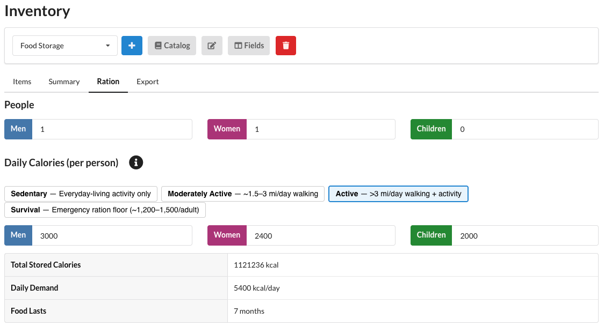
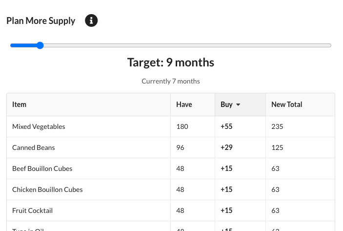

# Ration Estimate

When an [inventory](index.md) has a [calories field](index.md#field-types), a **Ration** tab appears. It estimates
how long your stored food will last a household.

* **People** — enter how many men, women, and children are in the household.
* **Daily Calories** — pick an activity level preset (Sedentary, Moderately Active, Active, or Survival), or edit
  the per-person daily calorie figures directly. The defaults come from the Dietary Guidelines for Americans
  2020-2025.

WROLPi then shows your **Total Stored Calories**, the household's **Daily Demand**, and how long the food
**Lasts**.

## Plan More Supply

Below the estimate, drag the slider to a target duration longer than your current supply to generate a shopping
list. WROLPi scales the whole inventory up proportionally — every item grows by the same factor so the mix stays
balanced — and rounds any split package up to a whole one. The result is a sortable table of how many additional
packages of each item to buy to reach the target.

The shopping list can be downloaded as a CSV or printed/saved as a PDF.
