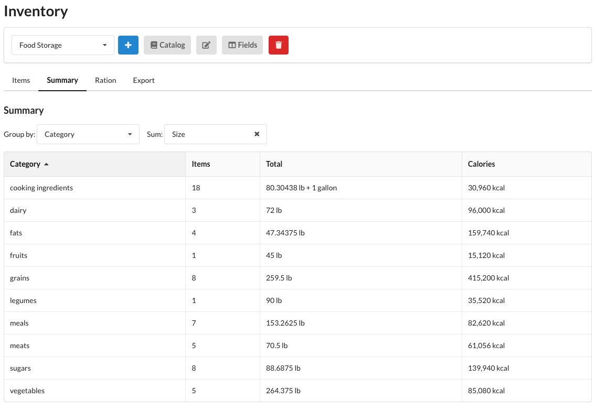

# Summary

The **Summary** tab aggregates the [inventory](index.md) entirely on your device. Choose a field to **Group by**
(such as Category) and a field to **Sum** (such as Size or Count). Quantities are summed with unit conversion and
compacted to a sensible unit (for example, 16 oz + 1 lb is shown as 2 lb). If the inventory has a
[calories field](index.md#field-types), a **Calories** column shows the stored calories per group. Click any column
header to sort.

Unlike the [Items](index.md#searching) tab's search, the Summary always uses the whole inventory, so the totals
here are never narrowed by a filter.
