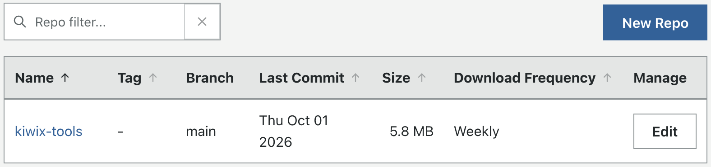
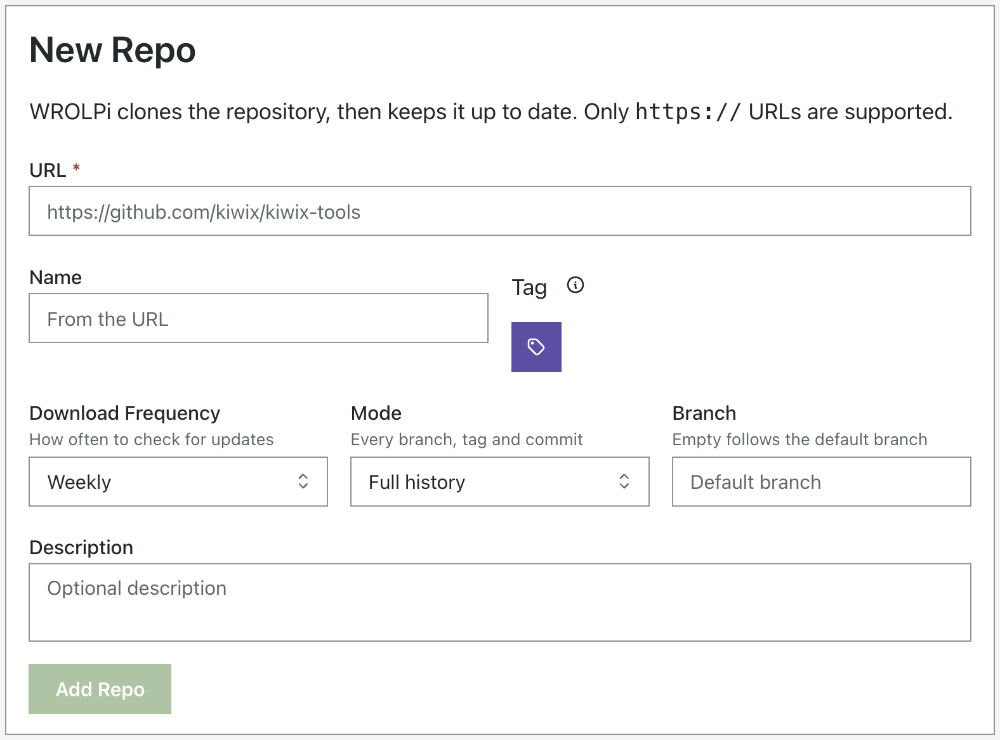
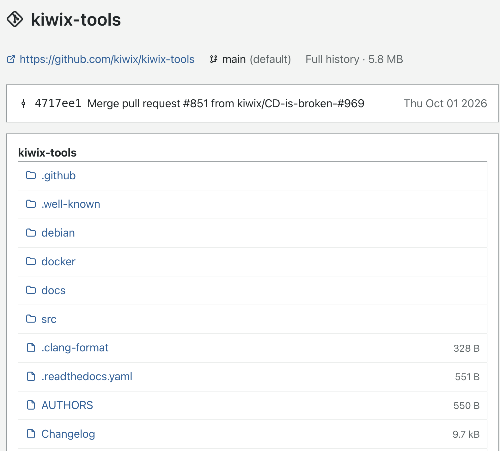

# Repos

The Repos module keeps a local copy of git repositories (source code, documentation, datasets) and keeps each copy up
to date while you have Internet access. You can browse a repo's files and read its README offline.

## Adding a Repo

> To add a repo, click **Repos** in the navigation bar, then click **New Repo**.

| Field              | Purpose                                                                                       |
|--------------------|-----------------------------------------------------------------------------------------------|
| URL                | The `https://` address of the repo, e.g. `https://github.com/kiwix/kiwix-tools`.              |
| Name               | Optional. Defaults to the last part of the URL (`kiwix-tools`).                               |
| Tag                | Optional. A tagged repo is saved under its Tag in the Repos Directory.                        |
| Download Frequency | How often WROLPi checks for updates. Weekly by default.                                       |
| Mode               | **Full history** (default) or **Snapshot**. See [Modes](#modes).                              |
| Branch             | Optional. Empty follows the repo's default branch (usually `main` or `master`).               |
| Include submodules | Optional. Also download the other repos this repo includes. See [Submodules](#submodules).   |
| Directory          | Optional. Where to save the repo; it must be empty. Empty saves it in the [Repos Directory](#repos-directory). |

WROLPi clones the repo in the background; its progress is on the Downloads page. Any git host that supports
`https://` works (GitHub, GitLab, Codeberg, Gitea, sourcehut, and others). SSH URLs, and repos that require a password,
are not supported.

You can also paste the URL of a branch, e.g. `https://github.com/kiwix/kiwix-tools/tree/dev`, and WROLPi will follow
that branch.

If two repos have the same name (e.g. two repos named `utils` from different owners), WROLPi asks you to choose another
name, such as `owner-utils`.

## Importing an Existing Clone

If you already have a git clone in your media directory, WROLPi can take it over instead of downloading it again.

> To import a clone, click **Repos** in the navigation bar, click **Import**, then choose the clone's directory.

WROLPi shows the clone's origin, branch and latest commit. Then:

* The clone **stays where it is**. Unless its directory is ignored, its files stay indexed (searchable); to keep them
  out of search, ignore the directory in Files.
* Its URL must be the clone's origin. An SSH origin like `git@github.com:owner/repo.git` is converted to its
  `https://` URL; if the clone has no origin, enter its URL.
* Like a new repo, it follows the remote's default branch unless you enter a Branch.

**Warning!** An imported clone becomes a mirror. Its first update discards local changes, untracked files, and any
commits that are not on the remote. WROLPi warns you if it has commits which are not on the remote; push them
first if you want to keep them.

WROLPi only updates clones it downloaded or imported. If a repo's directory already holds a different git clone, the
repo's download fails and explains that it must be imported.

## Modes

| Mode         | What is saved                                         | Size                                |
|--------------|-------------------------------------------------------|-------------------------------------|
| Full history | Every branch, tag and commit.                         | Can be many times larger than the files. |
| Snapshot     | Only the latest commit of one branch.                 | About the size of the files.        |

Full history is the default because storage is cheaper than a project you can no longer download. You can change the
mode of a repo at any time on its Edit page; switching from Snapshot to Full history downloads the rest of the history
on the next update.

## Updates

Each repo is checked for updates on its Download Frequency. Click **Update Now** on a repo's page to check right away.

A repo is a **mirror** of its source:

* Any change you make to a repo's files is discarded by the next update.
* Branches deleted by the source are kept.
* If the source rewrites its history (a "force push"), the commit WROLPi had is kept under
  `refs/wrolpi/backup/` in the repo, so nothing is lost.

If the source disappears (deleted, made private, or no Internet), **your copy is kept**. The repo's page shows
"The last update failed" with git's error, and the update is tried again later.

**Warning!** Git LFS files are not downloaded; they appear as small text files.

## Submodules

Some repos include other repos, called submodules. Check **Include submodules** to download them too. Submodules are
updated with their repo and use the same Mode.

Only `https://` submodules can be downloaded. For your network's safety, a submodule must be on the repo's own server or
on a public address; WROLPi will not download a submodule from a private address (like `192.168.1.10` or
`localhost`). If a submodule cannot be downloaded (for example, it uses an SSH URL like
`git@github.com:owner/repo.git`), the repo itself is still updated, and its download shows the submodule's error.
Unchecking **Include submodules** removes the submodules' files.

## Browsing a Repo

> To view a repo, click its name in the Repos table.

The repo's page shows its source, branch, size, and latest commit, then its files and its README. Click a directory to
open it, or a file to preview it. The README of each directory is shown below its files.

Click **History** to see the repo's commits, newest first. A Snapshot only keeps the latest commit.

> To copy a repo's files to another computer, click **Download ZIP** on the repo's page.

The ZIP contains the files of the latest commit (no history), so it works on computers without git.

## Search

A repo's name, owner, and README are searchable. Matching repos appear under the **Other** tab of the search results,
with the part of the README that matched. Repos are also suggested by name as you type a search.

The individual files in a repo are **not** searchable; see [Repos Directory](#repos-directory).

## Tagging and Deleting

> To tag a repo, click **Edit** on the repo's page, then click **Tag**.

Tagging a repo can move it into the Tag's directory, like other [Collections](../../system/collections/index.md).

> To delete a repo, click **Edit** on the repo's page, then click **Delete**.

WROLPi stops updating the repo. Its files are kept, unless you check **Also delete its files**.

## Repos Directory

Repos are saved in the `repos` directory of your media directory, using the **Repos Directory** setting on the
Settings page. The default is `repos/%(repo_tag)s/%(repo_name)s`.

| Variable          | Value                                     |
|-------------------|-------------------------------------------|
| `%(repo_name)s`   | The repo's name.                          |
| `%(repo_tag)s`    | The repo's Tag (empty if it has no Tag).  |
| `%(repo_owner)s`  | The owner from the URL (e.g. `kiwix`).    |
| `%(repo_host)s`   | The host from the URL (e.g. `github.com`). |

The Repos Directory must start with a fixed directory (like `repos/`) and contain `%(repo_name)s`. That fixed
directory is always ignored when WROLPi refreshes your files, so the many files of a repo do not crowd your file
search. It cannot be (or be inside) another special directory, like `videos` or `config`.

A repo saved in another directory (chosen when adding it, or imported where it was) is not ignored: its files are
indexed, unless you ignore that directory in Files.

## Config

Your repos are saved in `repos.yaml` in the [config directory](../../system/configs.md). If your database is lost, your
repos (and their download schedules) are restored from this file.
