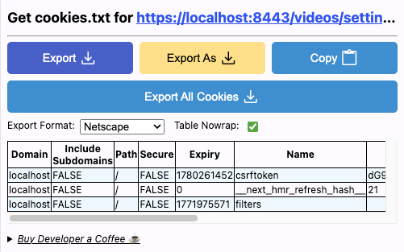
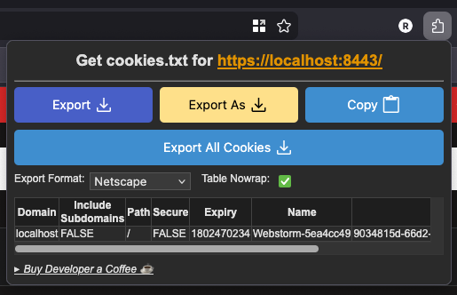
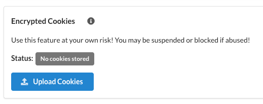
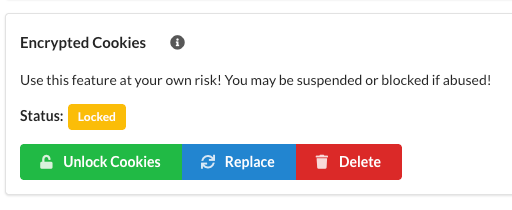
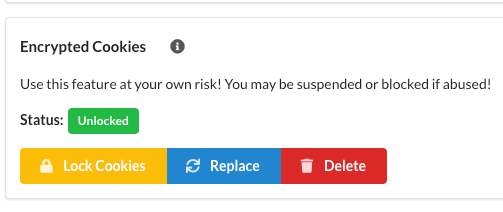

# Encrypted Cookies

WROLPi supports encrypted cookie storage for downloading videos from sites that require
authentication. Cookies are encrypted at rest and only decrypted to memory.

## Warning! "Use as a Last Resort"

Using cookies to download videos may violate the terms of service of some websites.
Your account could be rate-limited, blocked, or banned. WROLPi is not responsible
for any consequences of using this feature. Only use cookies when other download
methods fail.

## Why Use Cookies?

Some video sites require authentication to:

- Access age-restricted content
- Download subscriber-only videos
- Avoid rate limiting for logged-in users
- Access private or unlisted content

## Copying Cookies from Your Browser

To use this feature, you need to copy cookies from a browser where you're logged
into the video site. The easiest method is using a browser extension.

### Recommended Browser Extensions

#### cookies.txt (Chrome/Brave/Edge)

1. Install [cookies.txt](https://chrome.google.com/webstore/detail/cookiestxt/njabckikapfpffapmjgojcnbfjonfjfg) from the Chrome Web Store
2. Navigate to the video site and log in
3. Click the extension icon
4. Click **Copy** to copy the cookies to your clipboard

#### cookies.txt (Firefox)

1. Install [cookies.txt](https://addons.mozilla.org/en-US/firefox/addon/cookies-txt/) from Firefox Add-ons
2. Navigate to the video site and log in
3. Click the extension icon
4. Click **Copy** to copy the cookies to your clipboard

## Uploading Encrypted Cookies

Once you have exported your cookies:

1. Navigate to **Videos > Settings**
2. Scroll to the **Encrypted Cookies** section
3. Paste your cookie file contents into the text area
4. Enter a password (minimum 8 characters)
5. Click **Encrypt & Save**

Your cookies are now encrypted and stored securely.

## Unlocking Cookies for Downloads

Cookies remain locked by default. To use them for downloading:

1. Navigate to **Videos > Settings**
2. In the **Encrypted Cookies** section, enter your password
3. Click **Unlock**

Once unlocked:

- Cookies remain available in memory until locked or system restart
- All video downloads will automatically use the cookies
- The cookies indicator shows "Unlocked" status

## Locking Cookies

To clear cookies from memory:

1. Navigate to **Videos > Settings**
2. Click **Lock** in the Encrypted Cookies section

This immediately clears the decrypted cookies from memory. They remain encrypted
on disk and can be unlocked again with your password.

## Deleting Cookies

To permanently remove stored cookies:

1. Navigate to **Videos > Settings**
2. Click **Delete** in the Encrypted Cookies section
3. Confirm the deletion

This removes the encrypted cookie file. You'll need to re-export and upload cookies
if you want to use them again.

## Troubleshooting

### Wrong Password

If you enter an incorrect password when unlocking, you'll see an error message.
The encrypted cookies are not modified. Try again with the correct password.

### Cookies Expired

Cookies have expiration dates set by the website. If downloads start failing
after cookies worked previously:

1. Log into the video site in your browser
2. Export fresh cookies using your browser extension
3. Upload and encrypt the new cookies (no need to delete the old cookies, they will be replaced)

### Download Still Fails

If downloads fail even with unlocked cookies:

- Verify you copied cookies while logged in
- Close the browser window immediately after copying cookies to prevent them from being replaced
- Check that you copied cookies for the correct domain
- Try a different browser or clear cookies and re-authenticate
- Some sites may require additional authentication steps

## File Locations

| Item | Location |
|------|----------|
| Encrypted cookies | `{media_directory}/config/cookies.txt.enc` |
| Temporary files | `/dev/shm/w_*.tmp` (RAM-based) |

## Security Details

WROLPi implements several security measures to protect your cookies:

| Feature | Implementation |
|---------|----------------|
| **Encryption Algorithm** | Fernet (AES-128-CBC + HMAC-SHA256) |
| **Key Derivation** | PBKDF2-SHA256 with 480,000 iterations |
| **Salt** | 16 bytes random per encryption |
| **Password Minimum** | 8 characters |
| **Storage Location** | Encrypted file only; never plaintext on disk |
| **Memory Storage** | RAM-based temporary files (`/dev/shm`) |
| **Temp File Permissions** | `0o600` (owner-only) |
| **Secure Deletion** | Overwrite with zeros before unlinking |

### How Encryption Works

When you upload cookies:

1. A random 16-byte salt is generated
2. Your password is combined with the salt using PBKDF2-SHA256 (480,000 iterations)
3. The derived key encrypts your cookies using Fernet
4. The encrypted data is stored as `cookies.txt.enc` in your config directory
5. Your password is never stored

When you unlock cookies for downloading:

1. You provide your password
2. The salt is extracted from the encrypted file
3. Your password regenerates the encryption key
4. Cookies are decrypted to shared memory (not disk)
5. Each download gets a unique temporary file in `/dev/shm` (RAM)
6. Temporary files are overwritten with zeros and deleted after use

