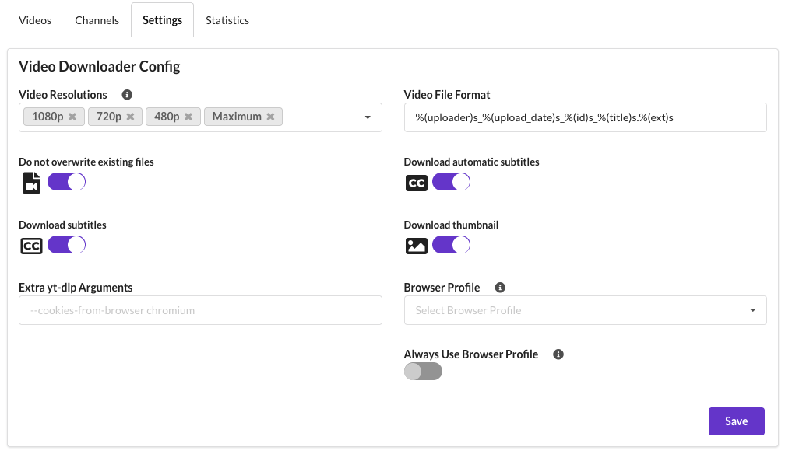
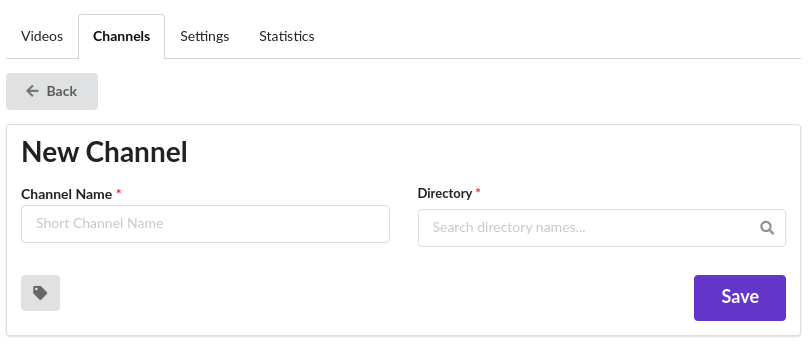
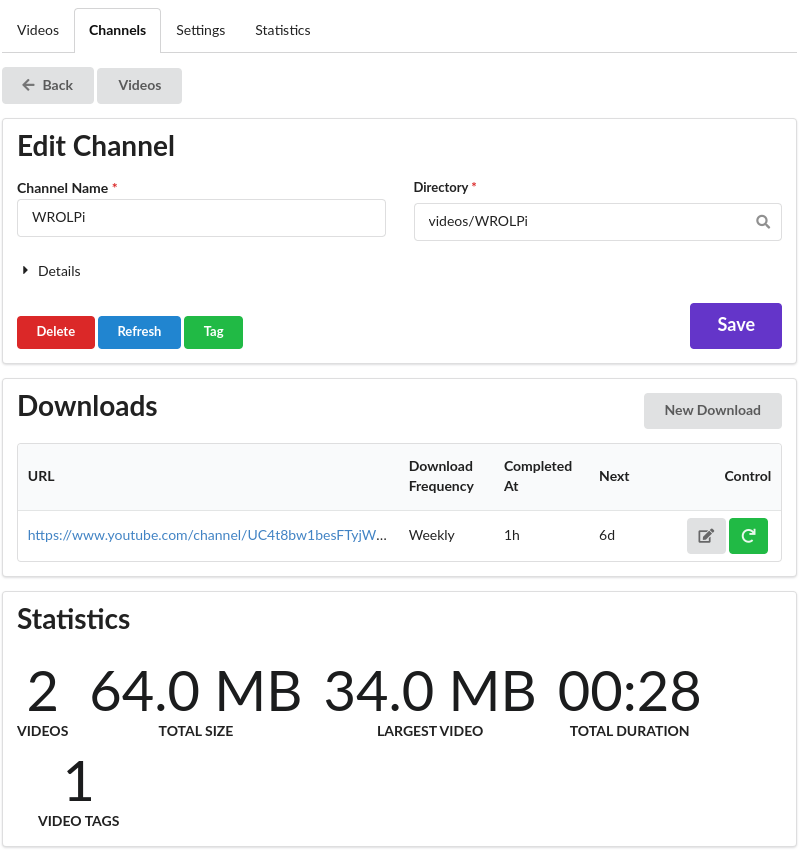

# Videos

## Overview

The Videos module facilitates the viewing, organizing, and downloading of video files. The main page of the
Videos Module (`/videos`) allows browsing all video files.

In the context of WROLPi, a Video refers to a set of [similarly named files](files.md) created during
download. A single video file is also supported.

## Video Format

As of the writing of this article, WROLPi favors MP4 files due to their small size and universal support.
WROLPi will index many other video formats.

## Downloading Videos

WROLPi will download a video (and related files) to that video's channel's directory. For example, if you downloaded a
video from the WROLPi channel, then your video will be stored in `videos/WROLPi` by default.

### Download Options

* **Videos Tags**
    * All selected Tags will be applied to every video downloaded.
* **Destination**
    * Override the default download directory by choosing a directory using the **Destination** input.
* **Video Resolutions**
    * Download each video in the first resolution matched. If you select "1080p, 720p" and a video has both resolutions
      available, it will use
      1080p, if no 1080p is available, then 720p will be downloaded, if neither resolutions is available an error will
      be reported.
* **Video Format**
    * The file format the video will be encapsulated in.
        * `mp4` is the most universally compatible (but proprietary).
        * `mkv` is an open-standard media format.
* **Channel Tag**
    * The selected Tag will be applied to any new Channel created in the process of downloading these videos. The
      Channel will be placed in the respective tag directory in the `videos` directory.

## Videos Settings

Behavior when downloading videos can be configured in the `Videos > Settings` page.

* **Video Resolutions**
    * Used to configure the default video resolutions to download. This will be suggested to you when downloading
      videos.
* **Video File Format**
    * Configure the name of the video file format (and related files). The default is
      `%(uploader)s_%(upload_date)s_%(id)s_%(title)s.%(ext)s`, this is used so the video files sort themselves by
      channel, then by date.
* **Do not overwrite existing files**
    * yt-dlp will not overwrite existing files. This is useful if you are downloading a video that has been partially
      downloaded.
* **Download Automatic Subtitles** and **Download subtitles**
    * Download captions for the video, if available.
* **Download Thumbnail**
    * Download the thumbnail for the video, if available.
* **Extra yt-dlp Arguments**
    * The text here will be split by spaces and passed as extra arguments to yt-dlp.
* **Sleep Between Requests**
    * Instructs yt-dlp to sleep between metadata requests. Helps reduce potential throttling.
* **User Agent**
    * The browser identity sent with requests. **If using encrypted cookies, select "Use Current Browser" to match the browser your cookies came from.**

## Authentication for Downloads

Some video sites require authentication to access age-restricted, subscriber-only, or private content.
WROLPi supports [Encrypted Cookies](cookies.md) for authentication. Export cookies from your browser
and upload them encrypted to WROLPi.

## Download Channels/Playlists

WROLPi can download all videos from a channel, or playlist. This is done using the `Download > Channel/Playlist`
download button.

### Download Options

* **Videos Tags**
    * All selected Tags will be applied to every video downloaded.

## Channel

A Channel contains all videos downloaded from the origin channel (the third-party site from which the video
was downloaded). When viewing a video, you will notice that the Older/Newer videos at the bottom of a page
are videos within the same channel. WROLPi will attempt to create a Channel for each video that you download.

A Channel can also be a directory of video files. This is useful when you have a collection of related videos
that you have not downloaded.

### Creating a Channel

There are two methods to create a channel: the simplest is by downloading a video, which will automatically create the
channel for you.

Alternatively, you can manually create a channel by navigating to the New Channel Page
(`/videos/channel/new`). Access this page by clicking **Videos**, selecting the **Channels** tab, and then clicking
**New Channel**.

Enter the new channel's name and its directory.

### Editing a Channel

To edit a Channel, navigate to the Channels (`/videos/channels`) page and click the 'Edit' button on the right. You will
be directed to the following page:

On this page, you can modify the channel name, or the directory.

**Warning:** If you change the Channel's directory, all files in the directory (video or not) will be moved to the new
directory you specified. If the automatic move fails somehow, you will need to manually move the files to the correct
directory, then refresh your files. You will probably need to manually re-apply any tags to your videos again. If you
are unsure what your previous tags were, open the `tags.yaml` config of the previous day (`/media/wrolpi/tags/backup`)
to see what tags you had applied.

#### Details

Under the **Details** dropdown, you will see the Channel's URL and RSS URL (if available).

**Tip:** You can use the RSS URL to download new videos from a Channel quickly after they are released.

#### Channel Tag

You can also tag a Channel here. Only one Tag can be applied to a Channel. After clicking the **Tag** button, the
following modal will suggest moving your Channel (and it's files) under the respective tag directory in the `videos`
directory. You can uncheck "Move to directory" if you do not want to use the suggested directory.

#### Buttons

**Delete**

* Used to delete the Channel. The files in the Channel's directory will not be deleted.

**Refresh**

* Refresh the files in the Channel's directory. Useful if you manually alter files in the directory.

**Tag**

* Add or replace the Tag of the Channel.

#### Downloads

You can add or update Downloads for this Channel.

#### Statistics

At the bottom of this page you will see the statistics of the channel's video files. This is useful if you want to be
sure that all videos were found during a refresh.

## Searching

When the indexes for a Video are generated for searching, they are searched in the following order of precedence:

1. Title
2. Description
3. Subtitles

## Videos without WROLPi

WROLPi comes with VLC pre-installed, this application allows you to watch video files, even if the React App is not
working. VLC also displays captions when the caption file is named like the video file (see
[Video Files](../videos/files.md)).

### Raspberry Pi

VLC can be launched by navigating: `Applications Menu > Sound & Video > VLC Media Player`

Any video file can be opened by navigating `Media > Open File`. VLC will automatically display captions files that
WROLPi has downloaded.
