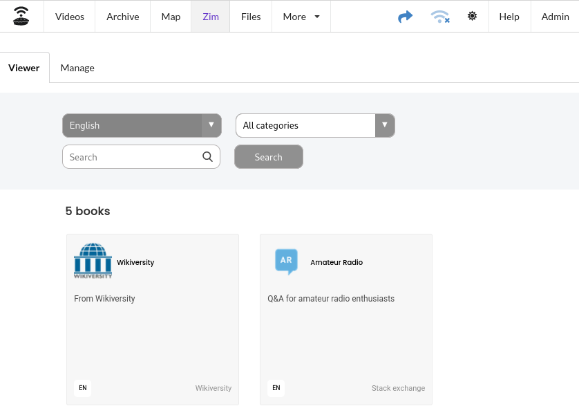
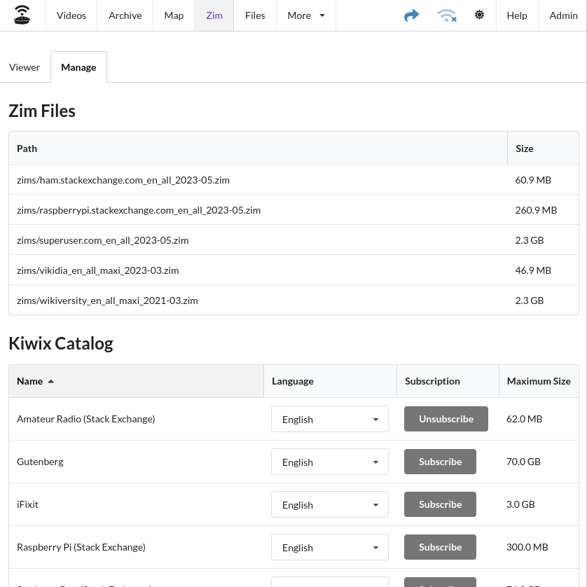
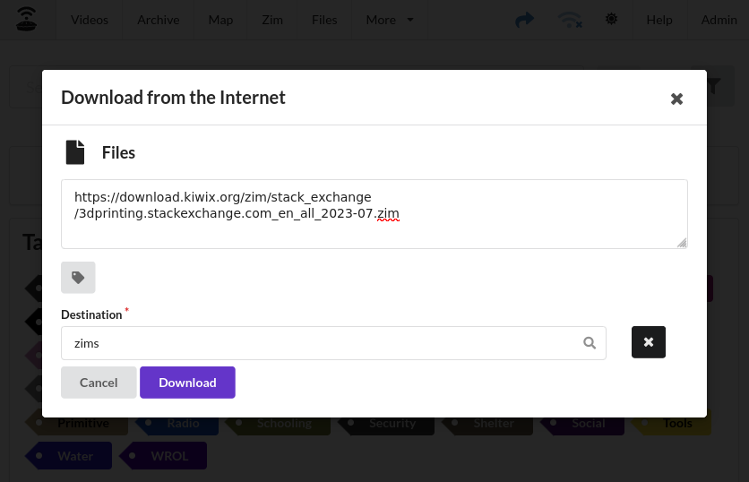
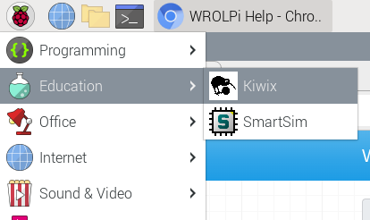

# Zim

The Zim module facilitates viewing, organizing, and downloading Zim files provided by the Kiwix project.

## Viewer

The Viewer tab is a simple iframe around the Kiwix service on port `:8085`

## Manage

The Manage tab displays a list of Zim files that WROLPi has detected, allowing for search and viewing capabilities.
It also offers a catalog from which select Kiwix Zim files can be subscribed to. The maximum sizes are estimates, based
on the historical data of each specific Zim file.

## Subscriptions

Zim files in the subscription list will be downloaded every 180 days. WROLPi will suggest deleting old Zim files through
a message on the home page, if any are detected at startup. You can safely unsubscribe from any Zim file without
automatic deletion of files.

### Custom Zim files

WROLPi will search any Zim file found in the `zims` directory, but not every project from Kiwix can be found in the
subscription list. If you would like to download a specific Zim file, use the **Files Downloader** and save the file to
the `zims` directory.  (You may need to restart your WROLPi for the new Zim file to be found.)

## Kiwix without WROLPi

WROLPi comes with Kiwix pre-installed, this application allows you to use your zim files even if the React App is not
working.

### Raspberry Pi

Kiwix can be started by navigating: `Applications Menu > Education > Kiwix`

Any zim file can be opened using the "Open" button on the top right of the Kiwix application. Zim files are usually
stored in `/media/wrolpi/zims`.