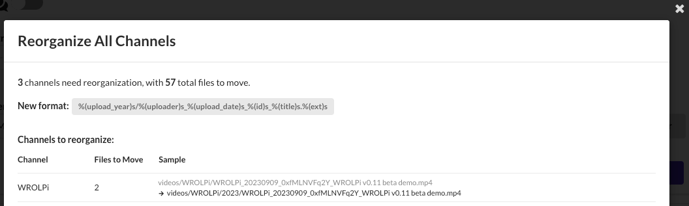
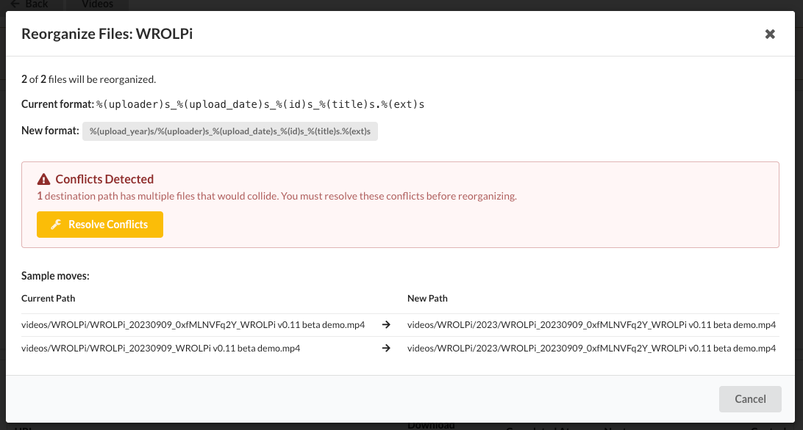
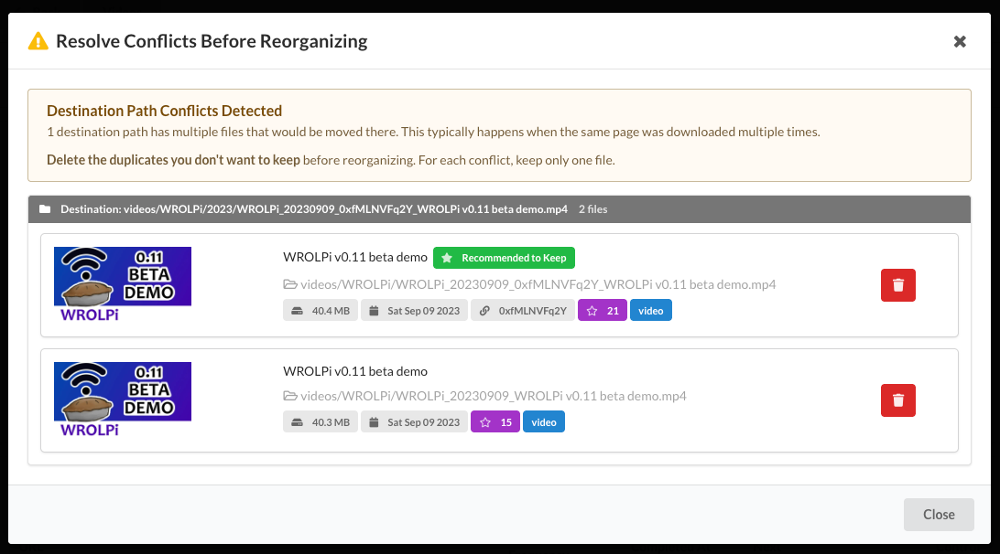
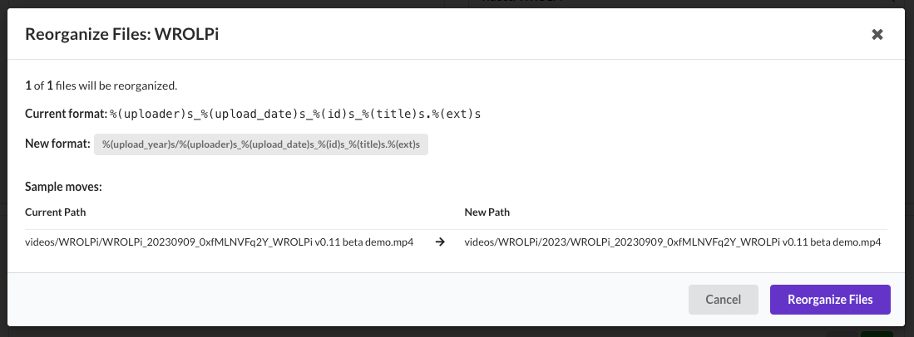
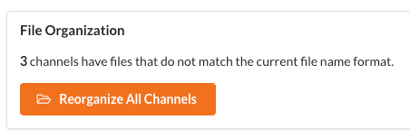

# Collection Reorganization

When you change your file naming format, existing files remain in their old locations.
Reorganization moves files to match the new format.

## When to Reorganize

Reorganization is needed when:

- You change your video or archive `file_name_format` in settings
- You want files organized by year/month when they weren't before
- You want to restructure how files are named within a collection

## Checking Reorganization Status

Collections that need reorganization show a notification in the UI. You can also check
the status from the collection page.

A collection needs reorganization when its stored `file_format` differs from the
current format in your settings.

## Reorganization Preview

Before moving any files, WROLPi shows a preview of what will change:

- Total files in the collection
- Number of files that will move
- Sample moves showing before/after paths
- Any conflicts that need resolution

## Conflict Resolution

A conflict occurs when multiple source files would move to the same destination.
For example, two videos with the same title would conflict if the format doesn't
include unique identifiers.

### Detecting Conflicts

Conflicts are detected during the preview phase, before any files move. WROLPi
shows which files conflict and provides information to help you decide which to keep.

### Quality Ranking

WROLPi assigns a quality rank to help identify which duplicate to keep. Higher
ranked files have more complete metadata and are recommended to keep.

**Video quality factors:**

- Has URL and source ID
- Has info JSON with complete metadata
- Has comments downloaded
- Has captions/subtitles
- Has audio streams
- Has poster image
- Has precise publish date

**Archive quality factors:**

- Has readability content
- Has screenshot
- Has title and author
- Has extracted text

### Resolving Conflicts

For each conflict group:

1. Review the conflicting files
2. The highest-ranked file shows as "recommended to keep"
3. Delete the lower-quality duplicates
4. After deletion, refresh the preview
5. Repeat until no conflicts remain

Only after all conflicts are resolved can reorganization proceed.

## Executing Reorganization

Once conflicts are resolved, click **Reorganize Files** to begin moving files.

The process:

1. Each file group moves to its new location
2. All related files move together (video + subtitles + poster, etc.)
3. Empty source directories are cleaned up
4. Database records update to reflect new paths
5. Collection's file format updates to match current settings

### Progress Tracking

During reorganization, progress displays showing:

- Files completed vs total
- Current file being moved
- Percentage complete

### Stopping and Resuming

If reorganization is interrupted (system restart, error, etc.):

- Files already moved stay in their new locations
- The collection's format is not updated
- You can retry reorganization to continue from the partial state
- WROLPi detects which files still need moving

## Batch Reorganization

When multiple collections need reorganization, you can reorganize them all at once.

Navigate to:

- **Videos > Settings > Reorganize All Channels** for video channels
- **Archive > Settings > Reorganize All Domains** for archive domains

Batch reorganization:

- Processes collections one at a time
- Shows overall progress across all collections
- Stops on first failure with error details
- Can be retried after resolving issues

## Common Issues

### File Not Found

If a source file doesn't exist:

- The file may have been manually moved or deleted
- Run a file refresh to resync the database
- Retry reorganization

### Destination Already Exists

If the destination path already has a file:

- This indicates a conflict that wasn't detected
- The file is skipped
- Check for duplicate files with similar names

### Permission Errors

If files can't be moved:

- Check that WROLPi has write access to both source and destination
- Verify disk space is available
- Check for mounted/unmounted drives

## Format Variables Reference

Available variables for file naming formats:

### Video Formats

| Variable           | Description                | Example     |
|--------------------|----------------------------|-------------|
| `%(title)s`        | Video title                | My Video    |
| `%(uploader)s`     | Channel/uploader name      | WROLPi      |
| `%(channel)s`      | Alias for uploader         | WROLPi      |
| `%(upload_date)s`  | Upload date (YYYYMMDD)     | 20240315    |
| `%(upload_year)s`  | Upload year                | 2024        |
| `%(upload_month)s` | Upload month (zero-padded) | 03          |
| `%(id)s`           | Platform video ID          | dQw4w9WgXcQ |
| `%(ext)s`          | File extension             | mp4         |

### Archive Formats

| Variable                | Description                  | Example             |
|-------------------------|------------------------------|---------------------|
| `%(title)s`             | Page title                   | Article Title       |
| `%(domain)s`            | Source domain                | example.com         |
| `%(download_datetime)s` | Download datetime            | 2024-03-15-14-30-00 |
| `%(download_date)s`     | Download date                | 2024-03-15          |
| `%(download_year)s`     | Download year                | 2024                |
| `%(download_month)s`    | Download month (zero-padded) | 03                  |
| `%(download_day)s`      | Download day (zero-padded)   | 15                  |
| `%(ext)s`               | File extension               | html                |
