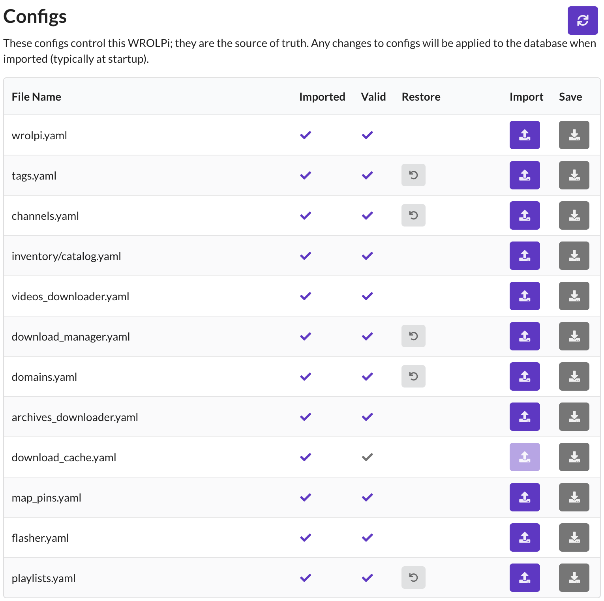

# How Configs Work

WROLPi stores your settings and everything you have curated (Tags, Channels, Playlists, Downloads, Inventories, etc.)
in plain YAML config files. **The config files are the source of truth** — the database is only an index that can be
rebuilt at any time from your files and configs.

This design means your WROLPi can be rebuilt, upgraded, or even moved to entirely new hardware without losing what
you have curated: your configs travel with your media drive.

## Where Configs Live

All configs are stored in the `config` directory of your media directory: `/media/wrolpi/config/`
(see [Special Directories](special-directories.md)).

| File | What it stores |
|---|---|
| `wrolpi.yaml` | Global settings: WROL Mode, hotspot, download limits and window, destinations, timezone, etc. |
| `tags.yaml` | Your [Tags](tags.md), and every tagged file and Zim entry. |
| `channels.yaml` | Your video Channels and their download schedules. |
| `domains.yaml` | Your Archive Domains. |
| `playlists.yaml` | Your Playlists, including the order of their items. |
| `repos.yaml` | Your [Repos](../modules/repos/index.md) and their download schedules. |
| `download_manager.yaml` | All of your Downloads, and the skip list of deleted URLs. |
| `videos_downloader.yaml` | Video downloader (yt-dlp) settings: resolutions, file name format, etc. |
| `archives_downloader.yaml` | Archive downloader settings. |
| `download_cache.yaml` | Cached video durations (safe to ignore). |
| `map_pins.yaml` | Your [Map](../modules/map/index.md) pins. |
| `bookmarks.yaml` | Your [Bookmarks](../modules/bookmarks/index.md), including their directories and order. |
| `recently_viewed.yaml` | Your 1,000 most recently viewed files, and [where you left off](viewing-progress.md) in each. |
| `inventory/*.yaml` | One file per [Inventory](../modules/inventory/index.md), plus the food catalog. |
| `cookies.txt.enc` | Your [encrypted cookies](../modules/videos/cookies.md). |
| `controller.yaml` | [Controller](../controller/index.md) settings: drives, Samba shares, hotspot. |
| `fstab.yaml` | The WROLPi-managed mount table for your drives. |
| `backup/` | Automatic dated backups of your configs (see below). |
| `ssl/` | Your generated [HTTPS certificates](certificates.md). |
| `wrolpi.db` | The [SQLite database](databases.md) (search index; rebuilt from files + configs). |

## The Source-of-Truth Model

1. **On startup**, WROLPi imports the config files into the database, making the database match the configs. This
   works in both directions: Tags are re-created, Channels are re-created, tagged files are re-tagged, and so on —
   but anything **removed** from a config is also **deleted** from the database (see
   [What imports can delete](#what-imports-can-delete) below).
2. **When you change something in the interface**, the change is written to the database *and* automatically saved
   back to the matching config file. Saves are debounced — if many changes happen quickly, only the final state is
   written.
3. **Before every save**, the previous file is copied into `config/backup/` with a dated name (for example
   `tags-20260703.yaml`), so you can recover from mistakes.

Because of this, the database can always be rebuilt: a file refresh re-indexes your media files, and a config import
restores everything you curated.

> The **Settings page has a Configs table** that shows every config file, whether it imported successfully, and lets
> you import or save each one manually.

## Editing Configs by Hand

You can edit any config file with a text editor — this is a supported way to make changes (for example, adding many
Channels at once). Keep in mind:

* WROLPi does **not** watch the files for changes. A hand-edit takes effect on the next startup, or when you click
  **Import** for that config in the Settings page's Configs table.
* The file must remain valid YAML. If a config fails to import, WROLPi keeps running, shows an error Event, and
  **refuses to overwrite that file** until it imports successfully — this protects your hand-edits from being lost.
* Each config contains a `version` counter. WROLPi refuses to overwrite a config file that is newer than the version
  it has in memory.

### What imports can delete

Imports are designed to be safe, but you should know the rules:

* A **missing or empty** config file never deletes anything from the database.
* Removing a Channel, Playlist or Repo from a non-empty `channels.yaml` / `playlists.yaml` / `repos.yaml` **will
  delete it** on the next import — this is how you can remove Collections by editing configs. A Channel's Downloads
  are deleted with it, but its videos are kept (they no longer belong to a Channel); a Repo's files are kept.
* Removing a Domain from `domains.yaml` only deletes it if it has no Archives. A Domain with Archives is kept (and written
  back to `domains.yaml` the next time Domains are saved), because deleting it would also delete its Archives.
* Removing a Tag from `tags.yaml` only deletes it if it is no longer used by anything.

## Backup and Restore

* Automatic dated backups of every config are kept in `config/backup/`.
* The Configs table in Settings supports **backup import** for the curated configs (Tags, Channels, Domains,
  Downloads, Playlists, and Inventories) with two modes: **merge** (add to what you have) or **overwrite** (replace
  with the backup).
* Backing up `/media/wrolpi/config/` along with your media files captures everything needed to rebuild your WROLPi.
  See [Backup](backup.md).

## What is *not* in Configs

A few things live only in the database and are lost if the database is rebuilt:

* Viewing history beyond your 1,000 most recently viewed files (see [Resume Where You Left Off](viewing-progress.md)).
* The file index itself (this is simply rebuilt by a file refresh).

Everything you deliberately curated — Tags, Channels, Playlists, Downloads, Inventories, pins, settings — is in the
configs and survives.
