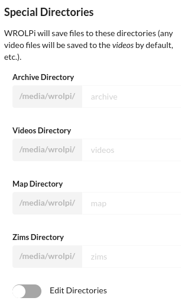

# External USB Drive Configuration

WROLPi expects a single USB drive to be mounted at `/media/wrolpi`. However, multiple drives are supported. WROLPi
uses special directories to know where to place downloaded files. The config special directories cannot be changed
and WROLPi will always look for it at `/media/wrolpi/config`

The default special directories are the following (the inputs are disabled because the "Edit Directories" toggle
is not checked):



## 2+ drives

As of the writing of this article, WROLPi partially supports multiple drives. The _primary_ drive must be mounted to
`/media/wrolpi`, the configs will be written to this drive. The other drive must be mounted within `/media/wrolpi`.

If you wanted your _secondary_ drive named "secondary", you could mount it at `/media/wrolpi/secondary`. Linux will
ensure the files are placed in the correct drives.

### Migrating from one to two drives

Assuming that you have a WROLPi with a single external hard drive, and would like to add a second drive, follow these
steps.

1. Mount the _secondary_ drive to some path in `/media/wrolpi`. We will assume you use `/media/wrolpi/secondary` for
   this example. Follow this pattern for all new drives.
    1. `mkdir /media/wrolpi/secondary`
    2. `mount /dev/sdb1 /media/wrolpi/secondary`
2. Decide where WROLPi will download files.
    1. WROLPi will download videos to `/media/wrolpi/videos` by default. If you want WROLPi to save new videos to
       the secondary drive, edit the "Videos Directory" in `Admin > Settings > Special Directories` to something like
       `secondary/videos`.
    2. Do this for all special directories.
    3. You can keep all special directories in the _primary_ drive, WROLPi will still search the _secondary_ drive for
       any new files.
3. Make the drive mounts permanent by modifying `/etc/fstab`:

    ```
    /dev/sda1 /media/wrolpi auto defaults,nofail 0 0           # primary
    /dev/sdb /media/wrolpi/secondary auto defaults,nofail 0 0  # secondary
    ```

4. Verify that the mounts are correct by rebooting.
    - `sudo reboot`
5. [Refresh your files](../modules/files/index.md#refreshing)