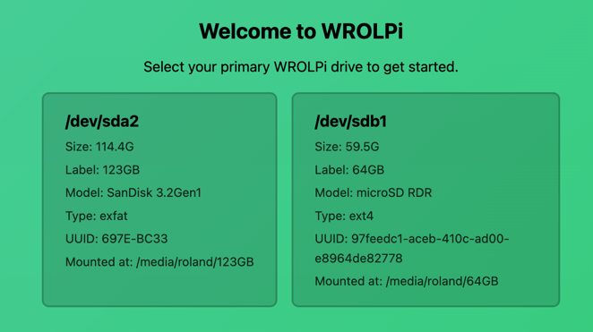
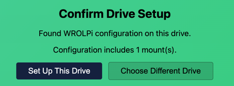
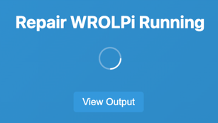

# Getting Started

## First Boot

When a WROLPi boots for the first time, it generates a temporary HTTPS certificate and starts the Controller
fallback UI. Your browser will be redirected to the Controller where you can complete the onboarding process.

### Onboarding

1. Open a browser to your WROLPi's address (e.g. `https://wrolpi.local` or `https://127.0.0.1` on the WROLPi
   itself).
2. Accept the self-signed certificate warning in your browser. This is expected on a fresh install.
3. The Controller will display the **Welcome to WROLPi** screen with your available drives.

4. Select the drive you want to use as your WROLPi media drive.
5. If the drive contains an existing WROLPi configuration, you will be asked to confirm. Click **Set Up This
   Drive** to proceed, or **Choose Different Drive** to go back.

6. WROLPi will mount the drive and start the repair script automatically. You will see a **Repair WROLPi
   Running** banner at the top of the page.

> This will take about 15 minutes on a Raspberry Pi 4.

7. Once repair completes, all services will start and you will be redirected to the main UI.

After onboarding, you should install the [HTTPS certificate](certificates.md) on your devices to avoid the
browser warning on future visits.

# Creating a new WROLPi

## Raspberry Pi

The following instructions are the steps necessary to create a new WROLPi, either as a backup, or to restore your WROLPi
on a new Raspberry Pi.

### Image an SD Card on Linux

1. Plug in your SD card, find its device path with: `sudo blkid`
2. Extract and copy the WROLPi image to your drive (/dev/sdb in this example):
    * `xzcat WROLPi-v0.19-aarch64-desktop.img.xz | sudo dd of=/dev/sdb status=progress`

### Image an SD Card on Windows

1. Copy the WROLPi image to your micro SD card using [Raspberry Pi Imager](https://www.raspberrypi.com/software/)

### First Boot

1. Unplug your Raspberry Pi
2. Insert the micro SD card into your Raspberry Pi
3. Connect any peripherals to your Raspberry Pi.
4. Boot your Raspberry Pi.
5. Choose your Country/Language/Timezone.
6. Choose your own username and password (do not use the wrolpi user).
7. Skip "Wi-Fi Selection", it is not required.
8. Choose your favorite browser.
9. Skip "Raspberry Pi Connect".
10. Skip "Update Software".
11. Restart.
12. Login using the user you created above.
13. A browser will open automatically. Follow the [Onboarding](#onboarding) steps above to select your drive and
    complete the installation.

## Debian

The following instructions are the steps necessary to create a new WROLPi, either as a backup, or to restore your WROLPi
on a new Debian computer.

1. Copy the Debian WROLPi ISO to a thumb-drive.
2. Insert the thumb-drive into the laptop, boot to the thumb-drive.
    1. Select **Start Installer**
    2. Install Debian 12.
3. Unplug the thumb-drive after the installation has completed
4. Login as the user you created during installation.
5. Reboot: `sudo reboot`
6. A browser will open automatically. Follow the [Onboarding](#onboarding) steps above to select your drive and
   complete the installation.
