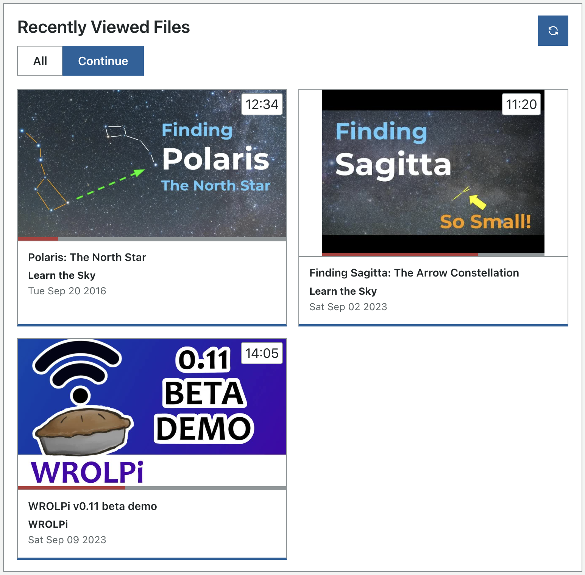

# Resume Where You Left Off

WROLPi remembers how far you are through your videos, audio, eBooks and comic books. When you open one again, it
picks up where you stopped — even on a different phone, tablet or computer.

## What is remembered

| File type | Where you left off | Finished when |
|---|---|---|
| Videos and audio | The playback time | You are 95% of the way through, or it plays to the end |
| EPUB eBooks | The page you were reading | You reach the end of the book |
| Comic books (`.cbz`, `.cbr`, `.cbt`, `.cb7`) | The page you were on | You reach the last page |

PDFs are shown in your browser's built-in PDF viewer, which does not tell WROLPi what page you are on, so PDFs are only
marked as viewed. Archives, images and text files are also only marked as viewed, and Zim articles are not
tracked.

Files in directories you [Ignore](../modules/files/index.md#files-tools) are never tracked.

## Resuming

Open a file from anywhere — its page, a search result, the [Files](../modules/files/index.md) browser, or a
preview — and it opens where you left off:

* A video or audio file jumps to where you stopped and keeps playing. If your browser blocks automatic playback
  (some phones do), it waits at that spot for you to press play.
* An eBook opens on the page you were reading.
* A comic book opens on the page you were on.

A file you **finished** starts again from the beginning.

A file you only **just started** is not resumed: the first 10 seconds of a video, the cover of a comic book, or the
first page of an eBook. Flipping back to the cover of a comic, or to the start of an eBook, does not lose your place.

> To start a video at a particular time instead, add `?t=` and the number of seconds to its address. For example,
> `/videos/123?t=90` starts at 1:30.

Opening an eBook from a search result still opens at the match, not where you left off.

### Using more than one device

Your place is saved on your WROLPi, not in your browser, so you can stop watching on a phone and continue on a laptop.
Whichever device saved most recently wins.

Your place is saved every 15 seconds while you watch or read, and again when you pause, close the page or switch to
another tab.

## Progress bars

Videos, audio files, eBooks and comic books show a bar along the bottom of their picture showing how far through them
you are. A full bar means you finished it. A file you have not started has no bar.

## Continue on the Dashboard

The **Recently Viewed Files** panel at the bottom of the Dashboard has two views:

* **All** shows the files you viewed most recently.
* **Continue** shows only the files you are part way through, most recent first.

> To find what you were in the middle of, click **Continue** in the Recently Viewed Files panel on the Dashboard.



WROLPi remembers which view you chose on each browser.

## The recently viewed config

Your viewing history is saved in the `recently_viewed.yaml` [config](configs.md), so it survives a rebuilt database,
like your Tags and Channels do. It holds the **1,000 most recently viewed files**: each file's path, when you last
viewed it, and how far through it you are.

```yaml
files:
  - path: videos/Channel Name/Video Title.mp4
    viewed: '2026-10-08T21:13:07+00:00'
    progress: 0.4
    position:
      kind: time
      seconds: 338.0
```

* The config is saved when you open a file, when you pause or close it, and after files are moved, renamed or
  deleted. While you are watching, your place is saved to the database every 15 seconds, but the config is only
  written when you stop, so your drive is not written to constantly.
* When the config is imported, a file you viewed more recently than the config was written keeps its newer place.
* Files that were deleted are skipped.
* Files older than the 1,000 most recent are still marked as viewed in the database, but are not in the config.
