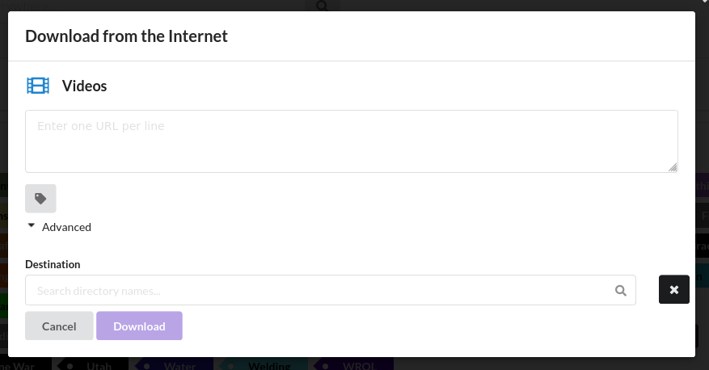
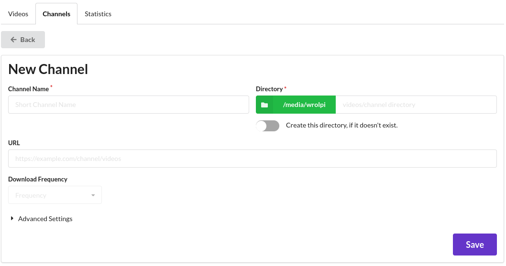
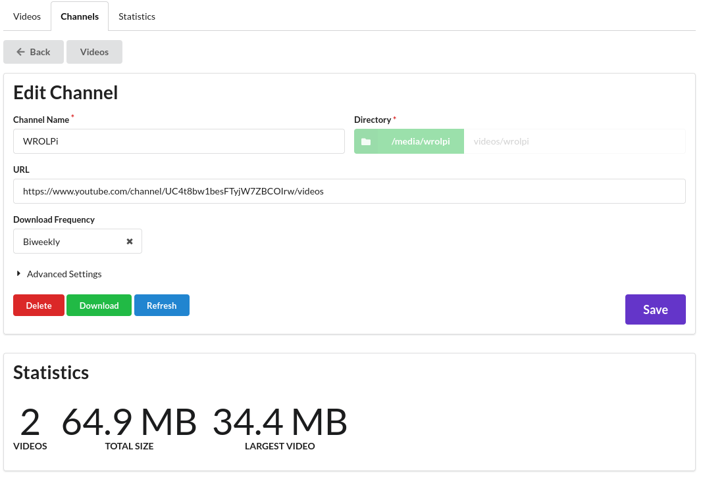

# Videos

## Overview

The Videos module facilitates the viewing, organizing, and downloading of video files. The main page of the
Videos Module (`/videos`) allows browsing all video files.

In the context of WROLPi, a Video refers to a set of [similarly named files](files.md) created during
download. A single video file is also supported.

## Video Format

As of the writing of this article, WROLPi favors MP4 files due to their small size and universal support.
WROLPi will index many other video formats, but it will always download an MP4 (this may be changed in the
future).

## Downloading

WROLPi will download a video (and related files) to that video's channel's directory. If you downloaded a
video from the WROLPi channel, then your video will be stored in `videos/WROLPi` by default.

It is possible to override the default download directory by opening the Advanced accordion on the Videos
download modal:

## Channel

A Channel contains all videos downloaded from the origin channel (the third-party site from which the video
was downloaded). When viewing a video, you will notice that the Older/Newer videos at the bottom of a page
are videos within the same channel. WROLPi will attempt to create a Channel for each video that you download.

A Channel can also be a directory of video files. This is useful when you have a collection of related videos
that you have not downloaded.

### Creating a Channel

There are two methods to create a channel: the simplest is by downloading a video, which will automatically create the
channel for you. Alternatively, you can manually create a channel by navigating to the New Channel Page
(`/videos/channel/new`). Access this page by clicking **Videos**, selecting the **Channels** tab, and then clicking
**New Channel**.

Enter the new channel's name and its directory. All other fields are optional  (be sure to enable
`Create this directory, if it doesn't exist` if necessary).

* Note: When entering a Channel's URL, you may need to append `/videos` to ensure the videos are downloaded to the
  correct location.

### Editing a Channel

To edit a Channel, navigate to the Channels (`/videos/channels`) page and click the 'Edit' button on the right. You will
be directed to the following page:

On this page, you can modify the download frequency, the channel name, or the URL. Currently, it is not possible to
change the channel's directory.

At the bottom of this page you will see the statistics of the channel's video files. This is useful if you want to be
sure that all videos were found during a refresh.